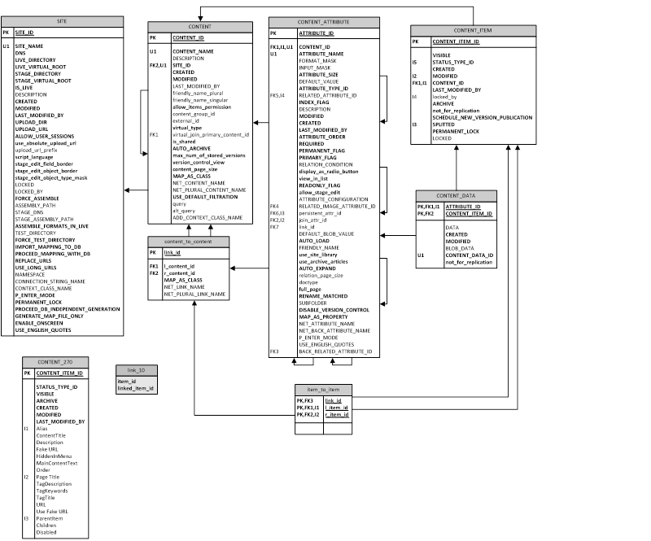

# Описание БД QP8.CMS

## Общие сведения

Данный документ описывает структуру БД QP8 Framework Release 6.0 (версия базы – 7.9.9.0). Эта структура обратно совместима с QP7.Framework той же версии базы, при этом новая функциональность QP8 не поддерживается в QP7. Минимальная версия SQL, на которой может работать данная версия системы – SQL Server 2012.

Пользователь, под которым работает бэкенд, должен либо входить в роль db_owner, либо одновременно входить в роли db_datareader, db_datawriter и иметь права доступа EXECUTE на все хранимые процедуры и функции, определенные в системе.

Если в системе определены виртуальные контенты, получающие информацию из внешних источников, следует иметь в виду, что запросы к этим базам выполняются под тем же логином, под которым производится соединение с основной базой.

## Основные таблицы и поля

### Общее описание

Таблицы могут быть разделены на пользовательские и системные. Системные таблицы присутствуют в системе всегда (в рамках текущей версии базы). Пользовательские отличаются от проекта к проекту, они создаются, обновляются и удаляются в результате действий пользователя. Информация о том, как должны создаваться пользовательские таблицы (метаинформация) хранится в системных таблицах. В данном разделе описаны основные системные таблицы, влияющие на создание пользовательских таблиц, а также общие поля пользовательских таблиц.

Пользовательские таблицы фактически являются "материализованными представлениями", то есть их можно использовать для быстрого чтения, но запись нужно осуществлять в системные таблицы, которые являются мастером для контентной информации (Таблица CONTENT_ITEM, Таблица CONTENT_DATA). Из этих системных таблиц информация с помощью триггеров и хранимых процедур переносится в пользовательские таблицы. Прямая запись в пользовательские таблицы запрещена, так как записанная информация будет утеряна при очередном срабатывании триггеров. Для изменения информации следует использовать один из вариантов API, описанных в [руководстве разработчика](https://storage.qp.qsupport.ru/qa_official_site/images/downloads/qp8-dev-man.pdf):

 - Метод MassUpdate класса DBConnector (раздел 5.4.1)
 - Класс ContentItem (раздел 5.4.4)
 - LINQ-to-SQL (раздел 5.5)
 - EF6 (раздел 5.6)
 - EF.Core (раздел 5.7)

_Рис. №1 Структура основных таблиц CMS QP8_

### Таблица SITE

#### Общее описание

Хранит информацию о логических сайтах, заведенных в системе. В зависимости от реализации один логический сайт может соответствовать нескольким физическим или наоборот.

#### Поля

##### SITE_ID

Уникальный числовой идентификатор, генерируется автоматически

##### SITE_NAME­

Уникальное имя сайта

##### DNS

Поле DNS (используется при формирования URL на сайт, в.т.ч. из бэкенда)

##### LIVE_DIRECTORY

Физический путь к live-папке сайта (используется только при создании сайта на шаблонах QP)

##### LIVE_VIRTUAL_ROOT ­

Виртуальный путь к live-папке сайта (используется при формирования URL на сайт, в.т.ч. из бэкенда)

##### STAGE_DIRECTORY

Физический путь к stage-папке сайта (используется только при создании сайта на шаблонах QP)

##### STAGE_VIRTUAL_ROOT

Виртуальный путь к stage-папке сайта (используется при формирования URL на сайт, в.т.ч. из бэкенда)

##### IS_LIVE

Булев признак, показывающий в каком режиме находится сайт: live или stage (влияет на сборку)

##### DESCRIPTION­

Описание сайта (в бэкенде QP8)

##### CREATED

Дата создания сайта. Генерируется автоматически

##### MODIFIED­

Дата последнего изменения сайта. Генерируется и изменяется автоматически.

##### LAST_MODIFIED_BY

ID последнего пользователя (Таблица USERS), менявшего свойства сайта

##### UPLOAD_DIR­

Физический путь к upload-папке сайта

##### UPLOAD_URL­

Виртуальный путь к upload-папке сайта

##### ALLOW_USER_SESSIONS

Булев признак, включающий на сайте пользовательские сессии (используется только при создании сайта на шаблонах QP)

##### use_absolute_upload_url

Булев признак, позволяющий задать явно префикс URL загрузки вместо неявного использования DNS

##### upload_url_prefix

Префикс URL

##### script_language

Типсборки

##### stage_edit_field_border

Настройки режима OnScreen в ASP. Устаревшее поле (сохранено для обратной совместимости)

##### stage_edit_object_border

Настройки режима OnScreen в ASP. Устаревшее поле (сохранено для обратной совместимости)

##### stage_edit_object_type_mask

Настройки режима OnScreen в ASP. Устаревшее поле (сохранено для обратной совместимости)

##### LOCKED

Дата последней блокировки свойств сайта (NULL, если свойства сайта не заблокированы)

##### LOCKED_BY

ID пользователя (Таблица USERS), заблокировавшего свойства сайт (NULL, если свойства сайта не заблокированы)

##### FORCE_ASSEMBLE

Булев признак, форсирующий сборку объектов вне зависимости от их даты модификации (используется только при создании сайта на шаблонах QP). После сборки параметр автоматически сбрасывается.

##### ASSEMBLY_PATH

Путь к bin-папке сайта в live-режиме (используется при копировании DLL, и для генерации классов для контентов)

##### STAGE_DNS

Поле DNS в stage-режиме. Если не задано, используется поле DNS.

##### STAGE_ASSEMBLY_PATH

Путь к bin-папке сайта в stage-режиме(используется при копировании DLL, и для генерации классов для контентов)

##### ASSEMBLE_FORMATS_IN_LIVE

Булев признак, форсирующий сборку служебных форматов (уведомления, preview) в live-режиме (используется только при создании сайта на шаблонах QP)

##### TEST_DIRECTORY

Тестовая папка для сборки (используется только при создании сайта на шаблонах QP)

##### FORCE_TEST_DIRECTORY

Булев признак, форсирующий сборку в тестовую папку (используется только при создании сайта на шаблонах QP)

##### IMPORT_MAPPING_TO_DB

Булев признак, заставляющий выполнить импорт LINQ-имен для контентов и полей из файла маппинга, заданного вручную. После импорта параметр автоматически сбрасывается.

##### PROCEED_MAPPING_WITH_DB

Булев признак, позволяющий выбрать сборку LINQ-классов по информации, заданной в базе, либо по файлу маппинга, заданного вручную.

##### REPLACE_URLS

Булев параметр, установка которого заставляет выполнять прямую и обратную замену плэйсхолдеров в LINQ-классах на реальные URL, использующиеся на сайте

##### USE_LONG_URLS

Булев параметр, указывающий на какие URL заменять плэйсхолдеры в LINQ-классах: на короткие или на длинные

##### NAMESPACE

Пространство имен для LINQ-классов

##### CONNECTION_STRING_NAME

Имя строки подключения из конфигурационного файла приложения для LINQ-классов

##### CONTEXT_CLASS_NAME

Имя генерируемого контекстного класса

##### P_ENTER_MODE

Выбор поведения визуального редактора при нажатии Enter (также влияет на другие сценарии). Глобальная настройка уровня сайта, которая может быть перекрыта на уровне поля. (P_ENTER_MODE)

##### PERMANENT_LOCK

Булев параметр, указывающий на то, что блокировка сайта является постоянной (сохраняющейся между сессиями пользователя).

##### PROCEED_DB_INDEPENDENT_GENERATION

Булев признак, указывающий создавать LINQ-классы, не привязанные К БД (при этом также создается map-файл, хранящий привязку классов к БД)

##### GENERATE_MAP_FILE_ONLY

Булев признак, указывающий создавать только map-файл (хранящий привязку классов к БД)

##### ENABLE_ONSCREEN

Устаревшее поле (сохранено для обратной совместимости)

##### USE_ENGLISH_QUOTES

Булев признак, определяющий поведение модуля типографирования визуального редактора: использовать английские кавычки или русские. Глобальная настройка уровня сайта, которая может быть перекрыта на уровне поля. (USE_ENGLISH_QUOTES)

##### EXTERNAL_URL

URL для вызова внешниху ведомлений

##### SEND_NOTIFICATIONS

Булев признак, указывающий посылать ли уведомления в сгенерированных LINQ-to-SQL классах

##### EXTERNAL_CSS

Поле, хранящее информацию об одном или нескольких внешних CSS, подключаемых к визуальному редактору. Глобальная настройка уровня сайта, которая может быть перекрыта на уровне поля (EXTERNAL_CSS).

##### ROOT_ELEMENT_CLASS

Поле, задающее класс для корневого элемента визуального редактора (полезно при использовании внешних CSS). Глобальная настройка уровня сайта, которая может быть перекрыта на уровне поля (ROOT_ELEMENT_CLASS).

##### XAML_DICTIONARIES

Текстовое поле типа NTEXT, хранящее информацию о XAML-словарях, использующихся механизмом пользовательской валидации статей.

##### CONTENT_FORM_SCRIPT

Хранит глобальные скрипты для форм статей (применяется для всех контентов)

#### Триггеры

##### ti_statuses_and_default_notif­

Выполняется после создания сайта, создает группу, статусы и шаблон уведомлений по умолчанию.

##### tu_site_formats_modified

Выполняется после обновления сайта. Изменяет даты модификации страниц и форматов при изменении существенных свойств сайта, влияющих на сборку (используется только при создании сайта на шаблонах QP)

##### ti_access_site

Выполняется после создания сайта. Дает максимальные права доступа на созданный сайт его автору

##### tbd_delete_site

Вызывается перед удалением сайта. Выполняет его быструю (по сравнению с каскадным удалением) и корректную очистку (обрабатываются циклические ссылки).

### Таблица CONTENT

#### Общее описание

Данная таблица хранит общую информацию о контентах (пользовательских таблицах, создаваемых посредством бэкенда QP8.Framework)

#### Поля

##### CONTENT_ID

Уникальный числовой идентификатор контента, генерируется автоматически

##### CONTENT_NAME

Уникальное (в пределах сайта) имя контента

##### DESCRIPTION

Описание контента (в бэкенде QP8)

##### SITE_ID

ID родительского сайта (Таблица SITE)

##### CREATED

Дата создания контента. Генерируется автоматически

##### MODIFIED

Дата последнего изменения контента. Генерируется и изменяется автоматически.

##### LAST_MODIFIED_BY

ID последнего пользователя (Таблица USERS), менявшего свойства контента

##### friendly_name_plural

Дружественное имя контента (множественное число). Не используется в QP8. Оставлено для совместимости с QP7

##### friendly_name_singular

Дружественное имя контента (единственное число). Не используется в QP8. Оставлено для совместимости с QP7

##### allow_items_permission

Флаг, включающий права доступа на уровне статей

##### content_group_id

ID родительской группы контентов (таблица CONTENT_GROUP)

##### external_id

Внешний ID контента (интеграция). Не используется в QP8. Оставлено для совместимости с QP7

##### virtual_type

Числовое поле, характеризующее тип виртуального контента, 0 соответствует реальному контенту

##### virtual_join_primary_content_id

ID базового контента, на котором строится виртуальный контент типа JOIN.

##### is_shared

Признак, указывающий на то, что контент является видимым для других сайтов в интерфейсе QP8

##### AUTO_ARCHIVE

Флаг, задающий следующее поведение: при удалении статей контента вместо удаления они помещаются в архив.

##### max_num_of_stored_versions

Максимальное число версий, которое хранится для каждой статьи контента. При превышении числа самая старая версия удаляется. Значение 0 соответствует тому, что версии не хранятся.

##### version_control_view

Создание отдельного представления для версий статей контента. Не используется в QP8. Оставлено для совместимости с QP7.

##### content_page_size

Число статей, показываемых на одной странице в табличном представлении контента

##### MAP_AS_CLASS

Признак, указывающий генерировать LINQ-класс для данного контента

##### NET_CONTENT_NAME

.NET-имяконтента. Используется при генерации LINQ-класса.

##### NET_PLURAL_CONTENT_NAME

.NET-имя контента (множественное число). Используется при генерации LINQ-класса.

##### USE_DEFAULT_FILTRATION

Признак, заставляющий генерируемый LINQ-класс использовать фильтрацию по умолчанию при чтении данных из базы.

##### Query

SQL запрос, определяющий виртуальный контент типа USER QUERY. В результате генерируется представление (Пользовательские представления вида CONTENT_NNN)

##### alt_query

SQL запрос, определяющий виртуальный контент типа USER QUERY для stage. В результате генерируется представление (Пользовательские представления вида CONTENT_NNN_UNITED)

##### ADD_CONTEXT_CLASS_NAME

Дополнительное имя контекстного класса. Позволяет сгенерировать для небольшой группы контентов отдельный контекстный класс.

##### XAML_VALIDATION

Правила пользовательской валидации статей контента, задаваемые в виде XAML. Могут ссылаться на словари (XAML_DICTIONARIES), заданные на уровне сайта

##### DISABLE_XAML_VALIDATION

Флаг, позволяющий временно отключить пользовательскую валидацию для статей контента, без удаления правил

##### DISABLE_CHANGING_ACTIONS

Флаг, запрещающий прямое редактирование содержимого контента через бэкенд QP8. Редактирование предполагается только через механизм JS-инетграции.

##### PARENT_CONTENT_ID

ID родительского контента (используется механизмом наследования)

##### USE_FOR_CONTEXT

Признак того, что контент используется для переключения контекстов (используется механизмом вариаций)

##### FORM_SCRIPT

Пользовательский JS-скрипт, подгружаемый при редактировании статей

#### _Триггеры_

##### tbd_delete_content

Вызывается перед удалением контента. Выполняет его быструю (по сравнению с каскадным удалением) и корректную очистку (обрабатываются циклические ссылки).

##### tiud_remove_empty_content_groups

Вызывается после создания, обновления, удаления контента. Удаляет пустые группы контентов (таблица CONTENT_GROUP), если они появились.

##### ti_insert_modify_row

Вызывается после создания контента. Добавляет запись в таблицу CONTENT_MODIFICATION(таблица CONTENT_MODIFICATION).

##### ti_access_content

Вызывается после создания контента. Создает правила доступа к контенту по умолчанию

##### ti_create_fields

Вызывается после создания контента. Создает поля контента по умолчанию

##### td_drop_table

Вызывается после удаления контента. Удаляет соответствующие пользовательские таблицы и представления

### Таблица CONTENT_ATTRIBUTE

#### Общее описание

Данная таблица хранит информацию о полях контентов (пользовательских таблиц, создаваемых через бэкенд QP8.Framework)

#### Поля

##### ATTRIBUTE_ID

Уникальный числовой идентификатор поля, генерируется автоматически

##### CONTENT_ID

Идентификатор родительского контента (Таблица CONTENT)

##### ATTRIBUTE_NAME

Уникальное имя поля (в пределах контента). Именно это имя становится названием столбца пользовательской таблицы (Пользовательские таблицы вида CONTENT_NNN).

##### FORMAT_MASK

В настоящее время не используется. Оставлено для обратной совместимости с QP7.

##### INPUT_MASK

Маска ввода для поля типа Строка. Задается в виде регулярного выражения.

##### ATTRIBUTE_SIZE

В данном поле хранятся разные значения для разных типов полей, например, для поля типа Строка хранится длина этой строки

##### DEFAULT_VALUE

Значение по умолчанию, для не-BLOB-полей (все кроме Визуальный редактор, Текстовое окно). Для связи типа M2M здесь хранится link_id, а само значение по умолчанию хранится в отдельной таблице (Таблица FIELD_ARTICLE_BIND).

##### ATTRIBUTE_TYPE_ID

ID типаполя (Таблица ATTRIBUTE_TYPE)

##### RELATED_ATTRIBUTE_ID

ID отображаемого поля для полей типа связь O2M (также косвенным образом указывает на связанный контент)

##### INDEX_FLAG

Признак, указывающий на то, что на поле создается индекс

##### DESCRIPTION

Описание поля (в бэкенде QP)

##### MODIFIED

Дата последнего изменения поля. Генерируется и изменяется автоматически.

##### CREATED

Дата создания поля. Генерируется автоматически

##### LAST_MODIFIED_BY

ID последнего пользователя (Таблица USERS), менявшего свойства контента

##### ATTRIBUTE_ORDER

Числовое значение, определяющее порядок полей в контенте (может не совпадать с физическим порядком полей в пользовательской таблице)

##### REQUIRED

Признак, указывающий на обязательность поля.

##### PERMANENT_FLAG

Не используется в QP8. Оставлено для совместимости с QP7

##### PRIMARY_FLAG

Не используется в QP8. Оставлено для совместимости с QP7

##### RELATION_CONDITION

Строка (используется в предложении WHERESQL-запроса), определяющая условие на связь (O2M или M2M)

##### display_as_radio_button

Не используется в QP8. Оставлено для совместимости с QP7

##### view_in_list

Признак, указывающий на то, что поле является отображаемым в табличном представлении контента

##### READONLY_FLAG

Признак, указывающий на то, что поле недоступно для редактирования через бэкенд

##### allow_stage_edit

Не используется в QP8. Оставлено для совместимости с QP7

##### ATTRIBUTE_CONFIGURATION

Не используется в QP8. Оставлено для совместимости с QP7

##### RELATED_IMAGE_ATTRIBUTE_ID

ID базового поля изображения (Таблица CONTENT_ATTRIBUTE) для поля типа Динамическое изображение.

##### persistent_attr_id

ID поля в базовом контенте (Таблица CONTENT_ATTRIBUTE), на котором построен виртуальное поле в JOIN-контенте

##### join_attr_id

ID поля в текущем виртуальном JOIN-контенте (Таблица CONTENT_ATTRIBUTE), которое является ближайшим связующим (ближайшим, необходимым для включении в иерархию).

##### link_id

ID связи между контентами (Таблица CONTENT_TO_CONTENT), для поля типа связь M2M. Наличие не-NULL значения в данном поле определяет тип связи (если ATTRIBUTE_TYPE_ID = 11) Если данное поле не NULL, то связь M2M, если NULL, то O2M.

##### DEFAULT_BLOB_VALUE

Значение по умолчанию для BLOB-полей (Визуальный редактор, Текстовое окно)

##### AUTO_LOAD

В QP7 используется как признак автозагрузки полей Визуальный редактор и Связь. В QP8 не используется. Оставлено для совместимости с QP7

##### FRIENDLY_NAME

Дружественное имя поля. Используется для отображения в бэкенде.

##### use_site_library

Признак для полей типа Файл и Изображение, указывающий использовать для хранения файлов библиотеку сайта вместо библиотеки контента

##### use_archive_articles

В QP7 управляет включением архивных статей в список отображаемых. Не используется в QP8. Оставлено для совместимости с QP7

##### AUTO_EXPAND

Управляет автоматическим развертыванием поля Визуальный редактор при загрузке формы статьи.

##### relation_page_size

Не используется в QP8. Оставлено для совместимости с QP7

##### Doctype

Строка, описывающая допустимый Doctype для визуального редактора.

##### full_page

Признак, разрешающий помещение в визуальный редактор целого документа, включающего теги html

##### RENAME_MATCHED

Признак, говорящий о том, что загружаемые в это поле файлы с одинаковыми именами должны переименовываться. В случае, если флаг сброшен, пользователю приходит запрос на перезапись файла.

##### SUBFOLDER

Для поля типа Файл или Изображение задает подпапку для загрузки файлов. Папка задается относительно текущей библиотеки сайта или контента (что определяется полем use_site_library)

##### DISABLE_VERSION_CONTROL

Возможность отключение хранения версий для поля типа Файл или Изображение.

##### MAP_AS_PROPERTY

Признак, указывающий генерировать LINQ-свойство для данного поля

##### NET_ATTRIBUTE _NAME

.NET-имя поля. Используется при генерации LINQ-свойства.

##### NET_BACK_ATTRIBUTE _NAME

.NET-имя обратного поля. Используется для поля типа Связь O2M, в том случае, если для него не задано обратное M2O-поле.

##### P_ENTER_MODE

Выбор поведения визуального редактора при нажатии Enter (также влияет на другие сценарии). Локальная настройка уровня поля, которая может перекрывать глобальную настройку уровня сайта (P_ENTER_MODE).

##### USE_ENGLISH_QUOTES

Булев признак, определяющий поведение модуля типографирования визуального редактора: использовать английские кавычки или русские. Локальная настройка уровня поля, которая может перекрывать глобальную настройку уровня сайта (USE_ENGLISH_QUOTES).

##### BACK_RELATED_ATTRIBUTE_ID

ID базовогополятипаСвязь O2M (Таблица CONTENT_ATTRIBUTE). Задается для поля типа Cвязь M2O.

##### IS_LONG

Признак, указывающий на то, что числовое поле нужно генерировать в LINQ-классе как Int64 (в противном случае генерируется Int32)

##### EXTERNAL_CSS

Поле, хранящее информацию об одном или нескольких внешних CSS, подключаемых к визуальному редактору. Локальная настройка уровня поля, которая может перекрывать глобальную настройку уровня сайта (EXTERNAL_CSS).

##### ROOT_ELEMENT_CLASS

Поле, задающее класс для корневого элемента визуального редактора (полезно при использовании внешних CSS). Локальная настройка уровня поля, которая может перекрывать глобальную настройку уровня сайта (ROOT_ELEMENT_CLASS).

##### USE_FOR_TREE

Признак, который задается у поля типа связь O2M, ссылающегося на тот же самый контент и говорящий о том, что поле нужно использовать для построения дерева.

##### AUTO_CHECK_CHILDREN

Признак, который задается у поля типа связь O2M, ссылающегося на тот же самый контент и говорящий о том, что при выделении родительского элемента в дереве нужно автоматически выделять дочерние элементы.

##### AGGREGATED

Признак, указывающий на то, что данное поле типа Связь реализует отношение агрегации.

##### CLASSIFIER_ATTRIBUTE_ID

ID поляклассификатора (Таблица CONTENT_ATTRIBUTE). Задается для агрегированных связей.

##### IS_CLASSIFIER

Признак того, что числовое поле реализует тип Классификатор

##### CHANGEABLE

Признак того, что значение поля типа Классификатор можно менять для существующих статей

##### USE_RELATION_SECURITY

Признак того, что по данной связи вычисляются права доступа на текущий контент (поддерживаются связи O2M и M2M)

##### COPY_PERMISSIONS_TO_CHILDREN

Признак, который задается у поля типа связь O2M, ссылающегося на тот же самый контент и говорящий о том, что при добавления нового элемента в иерархию, нужно скопировать права доступа у родительского элемента.

##### ENUM_VALUES

Поле с внутренней структурой, хранящее определение Строкового перечисления.

##### SHOW_AS_RADIO_BUTTON

Настройка поля Связь, определяющая его показ как список радиокнопок вместо выпадающего списка

##### USE_FOR_DEFAULT_FILTRATION

Признак, указывающий на то, что поле связь используется для механизма фильтрации по умолчанию

##### TREE_ORDER_FIELD

ID поля (Таблица CONTENT_ATTRIBUTE), которое используется для сортировке в поле связи

##### PARENT_ATTRIBUTE_ID

ID родительского поля (Таблица CONTENT_ATTRIBUTE), которое используется для реализации механизма наследования

##### HIDE

Признак указывающий на то, что унаследованное поле не должно отображаться

##### OVERRIDE

Признак указывающий на то, что унаследованное поле перекрывает родительское (не является его точной копией)

##### USE_FOR_CONTEXT

Признак того, что поле типа связь ссылается на контент, используемый для переключения контекстов (механизм вариаций)

##### USE_FOR_VARIATIONS

Признак того, что поле типа связь задает на базовую статью для вариаций

##### ORDER_BY_TITLE

Признак того, что сортировка по умолчанию для поля типа Связь должна выполняться по заголовку, а не по ID

##### FIELD_TITLE_COUNT

Количество полей, которые должны объединяться в заголовке при выводе списка для поля типа Связь

##### INCLUDE_RELATIONS_IN_TITLE

Флаг, указывающий учитывать ли поля связей при формировании заголовка

##### USE_IN_CHILD_CONTENT_FILTER

Флаг, указывающий что пользователь может использовать данное поле при фильтрации дочернего контента

#### Триггеры

##### ti_insert_field

Выполняется после создания поля. Добавляет соответствующее поле в контентные таблицы (Пользовательские таблицы вида CONTENT_NNN, Пользовательские таблицы вида CONTENT_NNN_ASYNC), а также перестраивает представления (Пользовательские представления вида CONTENT_NNN_UNITED, Пользовательские представления вида CONTENT_NNN_LIVE, Пользовательские представления вида CONTENT_NNN_STAGE)

##### tu_update_field

Выполняется после обновления поля. Обновляет соответствующее поле в контентной таблице (Пользовательские таблицы вида CONTENT_NNN, Пользовательские таблицы вида CONTENT_NNN_ASYNC), а также перестраивает представления (Пользовательские представления вида CONTENT_NNN_UNITED, Пользовательские представления вида CONTENT_NNN_LIVE, Пользовательские представления вида CONTENT_NNN_STAGE)

##### td_remove_field

Выполняется после удаления поля. Удаляет соответствующее поле из контентной таблицы (Пользовательские таблицы вида CONTENT_NNN, Пользовательские таблицы вида CONTENT_NNN_ASYNC), а также перестраивает представления (Пользовательские представления вида CONTENT_NNN_UNITED, Пользовательские представления вида CONTENT_NNN_LIVE, Пользовательские представления вида CONTENT_NNN_STAGE)

##### ti_set_max_order

Выполняется после создания поля. Устанавливает ATTRIBUTE_ORDER в значение большее, чем остальные поля контента

##### td_reorder_fields

Выполняется после удаления поля. Пересчитывает значения ATTRIBUTE_ORDER для остальных полей

##### tu_content_attribute_clean_empty_links

Выполняется после обновления поля. Удаляет ссылки между контентами (Таблица CONTENT_TO_CONTENT), которые перестали использоваться (link_id)

##### td_content_attribute_clean_empty_links

Выполняется после удаления поля. Удаляет ссылки между контентами (Таблица CONTENT_TO_CONTENT), которые перестали использоваться (link_id)

### Таблица CONTENT_ITEM

#### Общее описание

Данная таблица хранит служебную информацию о статьях контентов (записях в пользовательских таблицах, создаваемых через бэкенд QP8.Framework)

#### Поля

##### CONTENT_ITEM_ID

Уникальный числовой идентификатор, генерируется автоматически

##### VISIBLE

Флаг, позволяющий при его сбросе скрыть статью. Используется расписанием показа.

##### STATUS_TYPE_ID

ID статуса статьи по Workflow (Таблица STATUS_TYPE). Если на статью не назначено Workflow, то значением будет Published для текущего сайта.

##### CREATED

Дата создания статьи. Генерируется автоматически

##### MODIFIED

Дата последнего изменения статьи. Генерируется и изменяется автоматически.

##### LAST_MODIFIED_BY

ID последнего пользователя (Таблица USERS), менявшего свойства статьи

##### CONTENT_ID

ID родительского контента (Таблица CONTENT)

##### LOCKED

Дата последней блокировки статьи (NULL, если статья не заблокирована)

##### LOCKED_BY

ID пользователя (Таблица USERS), заблокировавшего статью (NULL, если статья не заблокирована)

##### ARCHIVE

Флаг, который указывает на то, что статья является архивной.

##### not_for_replication

Флаг, который указывает на то, что при изменении данных статьи в таблице CONTENT_DATA (Таблица CONTENT_DATA) информация не будет сразу перенесена в контентные таблицы (Пользовательские таблицы вида CONTENT_NNN, Пользовательские таблицы вида CONTENT_NNN_ASYNC), это должно произойти потом при вызове одной их хранимых процедур массового обновления

##### SCHEDULE_NEW_VERSION_PUBLICATION

Флаг, который говорит о том, что для статьи установлена отложенная публикация

##### SPLITTED

Вспомогательный флаг (устанавливается триггером), который говорит о том, что статья расщеплена.

##### PERMANENT_LOCK

Булев параметр, указывающий на то, что блокировка статьи является постоянной (сохраняющейся между сессиями пользователя).

##### CANCEL_SPLIT

Флаг, позволяющий отменить расщепление статьи

#### Триггеры

##### ti_insert_item

Выполняется после создания статьи. Добавляет строку, соответствующую добавленной статье в контентную таблицу (Пользовательские таблицы вида CONTENT_NNN)

##### tu_update_item

Выполняется после обновления статьи. Обновляет строку, соответствующую обновленной статье в контентной таблице (Пользовательские таблицы вида CONTENT_NNN). Кроме того, может создаваться, обновлятся и удаляться строка в асинхронной контентной таблице (Пользовательские таблицы вида CONTENT_NNN_ASYNC), реализуя расщепление и слияние статьи.

##### tiu_populate_content_data

Выполняется после создания или обновления статьи. Добавляет недостающие пустые записи в таблице CONTENT_DATA.

##### ti_save_content_item_history

Выполняется после создания статьи. Добавляет исторические записи в лог-таблицу (Таблица CONTENT_ITEM_STATUS_HISTORY)

##### tu_save_content_item_history

Выполняется после обновления статьи. Добавляет исторические записи в лог-таблицу (Таблица CONTENT_ITEM_STATUS_HISTORY)

##### tu_not_for_replication

Выполняется после обновления статьи. Cинхронизирует значения поля not_for_replication таблицы CONTENT_DATA с одноименным полем текущей таблицы

##### ti_access_content_item

Выполняется после создания статьи. Добавляет права доступа по умолчанию для статьи, если для контента включен режим прав доступа на статьи (Поле allow_items_permission)

##### tbd_delete_content_item

Выполняется перед удалением статьи. Удаляет все дочерние данные статьи для которых нет каскадного удаления.

### Таблица CONTENT_DATA

#### Общее описание

Хранит содержимое всех пользовательских таблиц (Пользовательские таблицы вида CONTENT_NNN). Каждая строка в данной таблице соответствует ячейке в пользовательской таблице и копируется туда триггером или одной из хранимых процедур массового копирования.

На полях DATA и BLOB_DATA построен полнотекстовый индекс

#### Поля

##### ATTRIBUTE_ID

Идентификатор поля – столбца пользовательской таблицы (Таблица CONTENT_ATTRIBUTE).

##### CONTENT_ITEM_ID

Идентификатор статьи – строки пользовательской таблицы (Таблица CONTENT_ITEM)

##### DATA

Текстовое поле для хранения относительно небольших значений (соответствует всем типам полей, кроме Визуального Редактора и Текстового окна).

##### CREATED

Дата создания записи. Генерируется автоматически

##### MODIFIED

Дата последнего изменения записи. Генерируется и изменяется автоматически.

##### BLOB_DATA

Текстовое поле для хранения больших значений (соответствует типам полей Визуальный Редактор и Текстовое окно).

##### CONTENT_DATA_ID

Уникальный идентификатор записи (используется для полнотекстового индекса)

##### not_for_replication

Флаг, который будучи установленнным отключает копирование информации из данной строки в ячейку пользовательской таблицы.

##### PARENT_CONTENT_DATA_ID

Идентификатор родительского элемента данных (Таблица CONTENT_DATA). Используется механизмом вариаций.

#### Триггеры

### Пользовательские таблицы вида CONTENT_NNN

#### Общее описание

Пользовательские таблицы. Их структура определяется в бэкенде QP8.Framework. Каждой таблице соответствует одна строка в таблице CONTENT (Таблица CONTENT). NNN в названии таблицы – ID записи в этой таблице. Таблица содержит фиксированное количество системных полей, описанных ниже и произвольное количество пользовательских полей. Каждому пользовательскому полю соответствует строка в таблице CONTENT_ATTRIBUTE (Таблица CONTENT_ATTRIBUTE). Каждой строке рассматриваемой таблицы соответствует строка в таблице CONTENT_ITEM (Таблица CONTENT_ITEM). Каждой ячейке в рассматриваемой таблице соответствует строка в таблице CONTENT_DATA (Таблица CONTENT_DATA).

Эти таблицы нельзя редактировать напрямую, вся информация в них заносится триггерами, либо хранимыми процедурами массового копирования.

#### Системные поля

##### CONTENT_ITEM_ID

Уникальный числовой идентификатор. Копируется триггером из поля CONTENT_ITEM_ID таблицы CONTENT_ITEM

##### VISIBLE

Флаг, управляющий показом/скрытием статьи. Копируется триггером из поля VISIBLE таблицы CONTENT_ITEM.

##### STATUS_TYPE_ID

ID статуса статьи по Workflow (Таблица STATUS_TYPE). Копируется триггером из поля STATUS_TYPE_ID таблицы CONTENT_ITEM.

##### CREATED

Дата создания статьи. Копируется триггером из поля CREATED таблицы CONTENT_ITEM.

##### MODIFIED

Дата последнего изменения статьи. Копируется триггером из поля MODIFIED таблицы CONTENT_ITEM.

##### LAST_MODIFIED_BY

ID последнего пользователя (Таблица USERS), менявшего свойства статьи. Копируется триггером из поля LAST_MODIFIED_BY таблицы CONTENT_ITEM.

##### ARCHIVE

Флаг, который указывает на то, что статья является архивной. Копируется триггером из поля ARCHIVE таблицы CONTENT_ITEM.

#### Пользовательские поля

Каждому пользовательскому полю (колонке пользовательской таблицы) соответствует запись в таблице CONTENT_ATTRIBUTE (Таблица CONTENT_ATTRIBUTE) для текущего контента. Название колонки берется из поля ATTRIBUTE_NAME. Тип данных определяется в соответствии со значением ATTRIBUTE_TYPE_ID колонкой DATABASE_TYPE в таблице ATTRIBUTE_TYPE. Размер данных берется из поля ATTRIBUTE_SIZE. Для NVARCHAR – это максимальная длина строки (по умолчанию – 255). Для NUMERIC – число знаков после запятой (по умолчанию – 0).

Поля типа файл или изображение хранят только название файла, сам файл хранится в файловой системе. Также в некоторых случаях поля типа файл и изображение и во всех случаях поле Динамическое изображения хранят относительный путь к файлу (от корня библиотеки или корневой подпапки (SUBFOLDER), если она задана).

Все типы полей, связанные с датами: Дата, Время, Дата & Время хранятся как DATETIME (совместимость со старыми версиями SQLServer)

Типы полей Визуальный редактор и Текстовое окно хранятся как NTEXT.

Поля M2O и М2М не хранят свои данные непосредственно в контентной таблице. Им соответствует тип данных NUMERIC. В контентой таблице они хранят вспомогательные данные. M2M – LINK_ID. M2O – BACK_RELATED_ATTRIBUTE_ID. Это позволяет на основании строки контентной таблицы сразу считывать связанные данные, не прибегая к дополнительным подзапросам.

Данные M2M хранятся в таблице ITEM_TO_ITEM (альтернативный способ доступа – представление ITEM_LINK)

Тип данных классификатор построен на числовом типе данных (ATTRIBUTE_TYPE_ID = 2). Он отличается установленным флагом IS_CLASSIFIER = 1. В таком поле хранится ID контента-расширения (CONTENT_ID), который используется в данной статье.

### Пользовательские таблицы вида CONTENT_NNN_ASYNC

#### Общее описание

Каждой таблице CONTENT_NNN (Пользовательские таблицы вида CONTENT_NNN) соответствует таблица CONTENT_NNN_ASYNC. Структура обеих таблиц совпадает. В последней хранятся текущие версии расщепленных статей (таких записей в таблице CONTENT_ITEM (Таблица CONTENT_ITEM), для которых установлено SPLITTED= 1)

### Таблица CONTENT_TO_CONTENT

#### Общее описание

Хранит информацию о связях между пользовательскими таблицами (контентами), которые не принадлежат ни одному из контентов. В контентах эти связи представлены как поля M2M. Одной связи может соответстовать 1 или 2 поля M2M в реальных контентах и произвольное количество полей в виртуальных контентах. Как только на данную связь больше не ссылается ни одно поле, она автоматически удаляется.

#### Поля

##### link_id

Уникальный идентификатор связи. Именно на него ссылается поле link_id в таблице CONTENT_ATTRIBUTE.

##### l_content_id

Идентификатор первого контента, участвующего в связи (Таблица CONTENT)

##### r_content_id

Идентификатор второго контента, участвующего в связи (Таблица CONTENT)

##### MAP_AS_CLASS

Признак, указывающий генерировать LINQ-класс для узлового представления (Пользовательские представления вида LINK_NN), относящегося к данной связи.

##### NET_LINK_NAME

.NET-имясвязи. Используется при генерации LINQ-класса.

##### NET_PLURAL_LINK _NAME

.NET-имя связи (множественное число). Используется при генерации LINQ-класса.

##### SYMMETRIC

Признак того, что связь является симметричной. Влияет на поведение триггера на таблице ITEM_TO_ITEM (Таблица ITEM_TO_ITEM)

#### Триггеры

##### ti_content_to_content

Выполняется после создания связи. Создает представления, относящиеся к связи (Пользовательские представления вида LINK_NN, Пользовательские представления вида LINK_NN_UNITED)

##### td_content_to_content

Выполняется после удаления связи. Удаляет представления, относящиеся к связи (Пользовательские представления вида LINK_NN, Пользовательские представления вида LINK_NN_UNITED)

##### tbd_delete_content_to_content

Вызывается перед удалением связи. Выполняет каскадное удаление данных M2M-полей, относящихся к удаляемой связи из таблиц ITEM_TO_ITEM и ITEM_LINK_ASYNC.

### Таблица ITEM_TO_ITEM

#### Общее описание

Хранит все данные полей M2M для статей, кроме текущих данных расщепленных статей, которые хранятся в таблице ITEM_LINK_ASYNC)

#### Поля

##### link_id

Идентификатор связи между контентами (Таблица CONTENT_TO_CONTENT).

##### l_item_id

Идентификатор первой статьи в данных M2M (Таблица CONTENT_ITEM).

##### r_item_id

Идентификатор второй статьи в данных M2M (Таблица CONTENT_ITEM).

#### Триггеры

##### td_item_to_item

Выполняется после удаления записи из таблицы. Удаляет симметричную запись, если это требуется (SYMMETRIC = 1)

##### ti_item_to_item

Выполняется после вставки записи в таблицу. Вставляет симметричную запись, если это требуется (SYMMETRIC = 1)

### Таблица ITEM_LINK_ASYNC

#### Общее описание

Хранит текущие данные полей M2M для расщепленных статей. Основные данные хранятся в таблице ITEM_TO_ITEM.

#### Поля

##### link_id

Идентификатор связи между контентами (Таблица CONTENT_TO_CONTENT).

##### item_id

Идентификатор первой статьи в данных M2M (Таблица CONTENT_ITEM).

##### linked_item_id

Идентификатор второй статьи в данных M2M (Таблица CONTENT_ITEM).

## Дополнительные таблицы и поля для работы с контентами

### Таблица ATTRIBUTE_TYPE

#### Общее описание

Справочная таблица, описывающие возможные типы полей контента (подтипы определяются не здесь, а в коде)

#### Поля

##### ATTRIBUTE_TYPE_ID

Уникальный идентификатор типа поля. Эти значения активно используются в коде как константы.

##### TYPE_NAME

Имятипаполя

##### DESCRIPTION

Описание типа поля

##### TYPE_IMAGE

Иконка типа поля. Не используется в QP8

##### DATABASE_TYPE

Тип генерируемого столбца в БД

##### INPUT_TYPE

Контрол ввода. Не используется в QP8

##### CHECK_FUNCTION

Проверка на доступность типа. Не используется в QP8

##### ICON

Иконка типа (в QP8)

### Таблица CONTENT_CONSTRAINT

#### Общее описание

Задает ограничения уникальности, определенные для полей контента

#### Поля

##### constraint_id

Уникальный идентификатор ограничения

##### content_id

ID контента, на котором определяется ограничение(Таблица CONTENT)

#### Триггеры

##### td_content_indexes

Срабатывает после удаления ограничения. Удаляет соответствующие индексы

##### tu_content_indexes

Срабатывает после обновления ограничения. Удаляет соответствующие индексы

### Таблица CONTENT_CONSTRAINT_RULE

#### Общее описание

Хранит информацию о полях, принимающих участие в ограничении уникальности

#### Поля

##### constraint_id

Идентификатор ограничения уникальности (Таблица CONTENT_CONSTRAINT)

##### attribute_id

Идентификатор поля (Таблица CONTENT_ATTRIBUTE)

### Таблица CONTENT_FOLDER

#### Общее описание

Хранит информацию о папках библиотеки контента

#### Поля

##### content_ID

Идентификаторсайта (Таблица CONTENT)

##### FOLDER_ID

Идентификатор папки. Генерируется автоматически

##### PARENT_FOLDER_ID

Идентификатор родительской папки

##### NAME

Имя папки

##### DESCRIPTION

Описание папки

##### FILTER

Не используется

##### PATH

Относительный путь к папке от корня библиотеки (заполняется автоматически триггером)

##### CREATED

Дата создания папки. Генерируется автоматически

##### MODIFIED­

Дата последнего изменения папки. Генерируется и изменяется автоматически.

##### LAST_MODIFIED_BY

ID последнего пользователя (Таблица USERS), менявшего свойства папки

#### Триггеры

##### tiu_content_folder_path

Срабатывает после создания или обновления свойств папки. Обновляет свойство PATH.

### Таблица FOLDER

#### Общее описание

Хранит информацию о папках библиотеки сайта

#### Поля

##### SITE_ID

Идентификатор сайта (Таблица SITE)

##### FOLDER_ID

Идентификатор папки. Генерируется автоматически

##### PARENT_FOLDER_ID

Идентификатор родительской папки

##### NAME

Имя папки

##### DESCRIPTION

Описание папки

##### FILTER

Не используется

##### PATH

Относительный путь к папке от корня библиотеки (заполняется автоматически триггером)

##### CREATED

Дата создания папки. Генерируется автоматически

##### MODIFIED­

Дата последнего изменения папки. Генерируется и изменяется автоматически.

##### LAST_MODIFIED_BY

ID последнего пользователя (Таблица USERS), менявшего свойства папки

#### Триггеры

##### tiu _folder_path

Срабатывает после создания или обновления свойств папки. Обновляет свойство PATH.

### Таблица CONTENT_GROUP

#### Общее описание

Хранит информацию о группах контентов

#### Поля

##### content_group_id

Идентификатор группы контентов. Генерируется автоматически

##### site_id

Идентификатор сайта (Таблица SITE)

##### name

Имя группы контентов

### Таблица CONTENT_ITEM_SCHEDULE

#### Общее описание

Хранит информацию о расписании статей

#### Поля

##### CONTENT_ITEM_ID

Идентификатор статьи, к которой применяется расписание (Таблица CONTENT_ITEM)

##### SCHEDULE_ID

Идентификатор расписания. Генерируется автоматически

##### MAXIMUM_OCCURENCES

Не используется

##### CREATED

Дата создания расписания. Генерируется автоматически

##### MODIFIED­

Дата последнего изменения расписания. Генерируется и изменяется автоматически.

##### LAST_MODIFIED_BY

ID последнего пользователя (Таблица USERS), менявшего свойства расписания

##### freq_type

Одноименный параметр инициализации хранимой процедуры sp_add_jobschedule

##### freq_interval

Одноименный параметр инициализации хранимой процедуры sp_add_jobschedule

##### freq_subday_type

Одноименный параметр инициализации хранимой процедуры sp_add_jobschedule

##### freq_subday_interval

Одноименный параметр инициализации хранимой процедуры sp_add_jobschedule

##### freq_relative_interval

Одноименный параметр инициализации хранимой процедуры sp_add_jobschedule

##### freq_recurrence_factor

Одноименный параметр инициализации хранимой процедуры sp_add_jobschedule

##### active_start_date

Одноименный параметр инициализации хранимой процедуры sp_add_jobschedule

##### active_end_date

Одноименный параметр инициализации хранимой процедуры sp_add_jobschedule

##### active_start_time

Одноименный параметр инициализации хранимой процедуры sp_add_jobschedule

##### active_end_time

Одноименный параметр инициализации хранимой процедуры sp_add_jobschedule

##### Occurences

Не используется

##### use_duration

Флаг, позволяющий указывать продолжительность задачи, а не дату окончания.

##### Duration

Продолжительность задачи

##### duration_units

Единицы измерения, для продолжительности задачи

##### DEACTIVATE

Флаг, позволяющий отключить расписание без его удаления

##### DELETE_JOB

Вспомогательный флаг, указывающий на то, что запись должна быть удалена, когда она перестанет использоваться

##### USE_SERVICE

Флаг, указывающий, создавать JOB или нет. Если USE_SERVICE = 1, JOB не создается, расписание статей при этом должно реализовываться внешним сервисом.

#### Триггеры

##### td_content_item_schedule_del_job

Вызывается после удаления записи о расписании. Удаляетсоответствующий Job.

##### ti_content_item_schedule_add_job

Вызывается после добавления записи о расписании. Создает соответствующий Job.

### Таблица CONTENT_ITEM_VERSION

#### Общее описание

Хранит информацию о версиях статей. Создание версии выполняется хранимой процедурой create_content_item_version (Процедура create_content_item_version)

#### Поля

##### CONTENT_ITEM_VERSION_ID

Уникальный идентификатор версии. Генерируется автоматически.

##### VERSION

В настоящее время не используется. Оставлено для обратной совместимости с QP7

##### VERSION_LABEL

В настоящее время не используется. Оставлено для обратной совместимости с QP7

##### CONTENT_VERSION_ID

Неиспользуется

##### CONTENT_ITEM_ID

Идентификатор статьи, для которой создается версия (Таблица CONTENT_ITEM)

##### DESCRIPTION

Описание версии

##### CREATED

Дата создания версии

##### CREATED_BY

ID пользователя (Таблица USERS), создавшего версию

##### MODIFIED

Дата последней модификации данных, которые содержит версия

##### LAST_MODIFIED_BY

ID пользователя (Таблица USERS), который последним модифицировал данные, содержащиеся в версии

#### Триггеры

##### tbd_content_item_version

Вызывается перед удалением версии. Выполняет необходимое каскадное удаление.

### Таблица VERSION_CONTENT_DATA

#### Общее описание

Хранит данные для версий статей, а именно копию данных из CONTENT_DATA (Таблица CONTENT_DATA).

#### Поля

##### ATTRIBUTE_ID

Идентификатор поля (Таблица CONTENT_ATTRIBUTE), для которого сохраняется версионная информация

##### CONTENT_ITEM_VERSION_ID

Идентификатор сохраняемой версии (Таблица CONTENT_ITEM_VERSION)

##### DATA

Копия поля DATA из таблицы CONTENT_DATA

##### BLOB_DATA

Копия поля BLOB_DATA из таблицы CONTENT_DATA

##### CREATED

Дата сохранения версионной информации

### Таблица ITEM_TO_ITEM_VERSION

#### Общее описание

Хранит данные полей M2M для версий статей

#### Поля

##### content_item_version_id

Идентификатор сохраняемой версии (Таблица CONTENT_ITEM_VERSION)

##### attribute_id

Идентификатор поля M2M (Таблица CONTENT_ATTRIBUTE), для которого сохраняется версионная информация

##### linked_item_id

Идентификатор связанной статьи (Таблица CONTENT_ITEM)

### Таблица CONTENT_MODIFICATION

#### Общее описание

Хранит данные о последних модификациях контентных таблиц. Заполняется автоматически. Используется клиентским кодом для организации поллинга и сброса кэша.

#### Поля

##### CONTENT_ID

Идентификатор контента (Таблица CONTENT)

##### LIVE_MODIFIED

Последняя дата модификации данных для Live-сайта

##### STAGE_MODIFIED

Последняя дата модификации данных для Stage-сайта

### Таблица CONTENT_WORKFLOW_BIND

#### Общее описание

Хранит привязку контентов к Workflow

#### Поля

##### CONTENT_ID

Идентификатор контента (Таблица CONTENT)

##### WORKFLOW_ID

Идентфикатор Workflow (Таблица WORKFLOW)

##### is_async

Признак того, что статьи могут расщепляться

### Таблица ARTICLE_WORKFLOW_BIND

#### Общее описание

Хранит привязку статей к Workflow

#### Поля

##### CONTENT_ITEM_ID

Идентификатор статьи (Таблица CONTENT_ITEM)

##### WORKFLOW_ID

Идентфикатор Workflow (Таблица WORKFLOW)

##### is_async

Признак того, что статья может расщепляться

### Таблица FIELD_ARTICLE_BIND

#### Общее описание

Хранит значения по умолчанию для полей M2M. Для других типов полей значения по умолчанию хранятся непосредственно в таблице CONTENT_ATTRIBUTE (DEFAULT_BLOB_VALUE, DEFAULT_VALUE)

#### Поля

##### ARTICLE_ID

Идентификатор статьи (Таблица CONTENT_ITEM)

##### FIELD_ID

Идентификатор поля (Таблица CONTENT_ATTRIBUTE)

### Таблица NOTIFICATIONS

#### Общее описание

Хранит настройки уведомлений

#### Поля

##### NOTIFICATION_ID

Уникальный идентификатор уведомления. Генерируется автоматически.

##### NOTIFICATION_NAME

Уникальное в пределах контента имя уведомления

##### CONTENT_ID

Идентификатор родительского контента (CONTENT_ID)

##### FORMAT_ID

Идентификатор формата (Таблица OBJECT_FORMAT) для генерации тела письма

##### USER_ID

Идентификатор пользователя (Таблица USERS), которому будет послано уведомление

##### GROUP_ID

Идентификатор группы пользователя (Таблица USER_GROUP), которой будет послано уведомление

##### FOR_CREATE

Флаг, указывающий, что уведомление будет послано при создании новой статьи

##### FOR_MODIFY

Флаг, указывающий, что уведомление будет послано при обновлении существующей статьи

##### FOR_REMOVE

Флаг, указывающий, что уведомление будет послано при удалении существующей статьи

##### CREATED

Дата создания версии

##### MODIFIED

Дата последней модификации данных, которые содержит версия

##### LAST_MODIFIED_BY

Идентификатор пользователя (Таблица USERS), который последним модифицировал данные, содержащиеся в версии

##### for_status_changed

Флаг, указывающий, что уведомление будет послано при изменении статуса существующей статьи

##### for_frontend

Флаг, указывающий, что уведомление будет послано только при программном вызове

##### notify_on_status_type_id

Идентификатор статуса на который должно быть послано уведомление (при установленном флаге for_status_changed) (Таблица STATUS_TYPE)

##### email_attribute_id

Идентификатор поля текущего контента, содержащее e-mail, на который будет послано уведомление (Таблица CONTENT_ATTRIBUTE)

##### no_email

Флаг, указывающий, что e-mail посылать не нужно. Уведомление является просто триггером для вызова некоторого кода.

##### send_files

Флаг, определяющий посылать ли поля типа файла как вложения

##### workflow_id

Идентификатор Workflow (Таблица WORKFLOW). Если он установлен, уведомление было создано автоматически для Worfklow.

##### from_backenduser_id

Идентификатор пользователя (Таблица USERS), который будет указан в письме как отправитель

##### from_backenduser

Флаг, указывающий, что для идентификации отправителя будет использовано поле from_backenduser_id

##### from_default_name

Флаг, указывающий, что в качестве отправителя будет использован пользователь бэкенда по умолчанию.

##### from_user_email

Текстовое поле, явно указывающее e-mail отправителя

##### from_user_name

Текстовое поле, явно указывающее имя отправителя

##### for_status_partially_changed

Флаг, указывающий, что уведомление будет послано при частичном изменении статуса существующей статьи (ParallelWorkflow)

##### USE_QA_MAIL

Используется только в QP7 для ASP-сайтов. Указывает на то, что при отправке уведомлений по почте надо использовать компонент QA_Mail (отсутствует в новых поставках)

##### IS_EXTERNAL

Флаг, указывающий, что уведомление является внешним.

##### EXTERNAL_URL

Внешний URL (для внешнего уведомления)

##### FOR_DELAYED_PUBLICATION

Флаг, указывающий, что уведомление будет послано при отложенной публикации

##### USE_SERVICE

Внешнее уведомление должно быть обработано асинхронно (с использованием сервиса)

### Таблица EXTERNAL_NOTIFICATION_QUEUE

#### Общее описание

Таблица, реализующая очередь уведомлений для отправки внешним сервисом

#### Поля

##### ID

Идентификатор записи в очереди. Генерируется автоматически

##### EVENT_NAME

Код типа уведомления

##### ARTICLE_ID

Идентификатор статьи, для которой отправляется уведомление

##### CREATED

Дата создания записи

##### URL

Внешний URL

##### TRIES

Количество неудачных попыток отправки

##### NEW_XML

XML новой версии статьи (после события)

##### OLD_XML

XML старой версии статьи (до события)

##### SENT

Успешно ли отправлено уведомление?

### Таблица NOTIFICATIONS_SENT

#### Общее описание

Таблица, хранящая информацию о посылках уведомлений пользователям бэкенда

#### Поля

##### user_id

Идентификатор пользователя, которому было послано уведомление (Таблица USERS)

##### notification_id

Идентификаторуведомления (Таблица NOTIFICATIONS)

##### content_item_id

Идентификатор статьи, для которой было послано уведомления (Таблица CONTENT_ITEM)

##### sent

Дата посылки

##### event_txt

Код события, для которого сработало уведомление

### Таблица CHILD_DELAYS

#### Общее описание

Хранит информацию об отложенной публикации дочерних статей (используется совместно с полями связи типа M2O)

#### Поля

##### Id

Идентификатор родитльской статьи (контент содержит поле M2O) (Таблица CONTENT_ITEM)

##### child_id

Идентификатор дочерней статьи (контент содержит поле O2M) (Таблица CONTENT_ITEM)

### Таблица DYNAMIC_IMAGE_ATTRIBUTE

#### Общее описание

Таблица-расширение для таблицы CONTENT_ATTRIBUTE. Хранит специфическую информацию для полей типа Динамическое изображение.

#### Поля

##### ATTRIBUTE_ID

Идентификатор поля (Таблица CONTENT_ATTRIBUTE)

##### WIDTH

Ограничение ширины динамического изображения

##### HEIGHT

Ограничение высоты динамического изображения

##### TYPE

Расширение генерируемого файла

##### QUALITY

Качество сжатия JPG

##### MAX_SIZE

Флаг, указывающий, что изображение должно быть вписано в прямоугольник WIDTHxHEIGHT (должны быть заданы оба) с сохранением пропорций

### Таблица MASK_TEMPLATE

#### Общее описание

Хранит стандартные маски (регулярные выражения) для проверки полей типа Строка. При выборе маски значение поля MASK копируется в поле FORMAT_MASK.

#### Поля

##### ID

Идентификатор маски

##### MASK

Регулярное выражение

##### NAME

Отображаемый заголовок

### Таблица UNION_ATTRS

#### Общее описание

Хранит привязку полей виртуального контента типа UNION к полям базового контента(контентов), на которых они построены

#### Поля

##### virtual_attr_id

Идентификатор поля в виртуальном контенте типа UNION (Таблица CONTENT_ATTRIBUTE)

##### union_attr_id

Идентификатор базового поля в исходном контенте (Таблица CONTENT_ATTRIBUTE)

##### EF_FIX

Служебное поле, используется для создания корректной модели EF

### Таблица UNION_CONTENTS

#### Общее описание

Хранит привязку виртуального контента типа UNION к базовым контентам, на которых он построены

#### Поля

##### virtual_content_id

Идентификатор виртуального контента типа UNION (Таблица CONTENT)

##### union_content_id

Идентификатор базового контента (Таблица CONTENT)

##### master_content_id

Идентификатор мастер-контента (Таблица CONTENT). Не используется в QP8, оставлено для обратной совместимости с QP7

#### Триггеры

##### ti_union_contents_auto_map_attrs

Выполняется после вставки новых записей. Осуществляет автоматическое заполнение таблицы UNION_ATTRS.

### Таблица USER_QUERY_ATTRS

#### Общее описание

Хранит привязку виртуального контента типа USERQUERY к используемым базовым полям.

#### Поля

##### virtual_content_id

Идентификатор виртуального контента типа USERQUERY (Таблица CONTENT)

##### user_query_attr_id

Идентификатор базового поля в исходном контенте (Таблица CONTENT_ATTRIBUTE)

### Таблица USER_QUERY_CONTENTS

#### Общее описание

Хранит привязку виртуального контента типа USERQUERY к используемым базовым контентам.

#### Поля

##### virtual_content_id

Идентификатор виртуального контента типа USERQUERY (Таблица CONTENT)

##### real_content_id

Идентификатор базового контента (Таблица CONTENT)

##### is_id_source

В настоящее время не используется

### Таблица WAITING_FOR_APPROVAL

#### Общее описание

Хранит информацию о частичном утверждении статей при параллельном Workflow

#### Поля

##### CONTENT_ITEM_ID

Идентификатор частично утвержденной статьи (Таблица CONTENT_ITEM)

##### USER_ID

Идентификатор пользователя, который утвердил статью (Таблица USERS)

##### STATUS_TYPE_ID

ID статуса статьи по Workflow (Таблица STATUS_TYPE).

### Таблица WORKFLOW

#### Общее описание

Хранит настройки Workflow

#### Поля

##### WORKFLOW_ID

Идентификатор Workflow. Генерируется автоматически

##### WORKFLOW_NAME

Уникальное в пределах сайта имя Workflow

##### DESCRIPTION

Описание

##### CREATED

Дата создания Workflow. Генерируется автоматически

##### MODIFIED­

Дата последнего изменения Workflow. Генерируется и изменяется автоматически.

##### LAST_MODIFIED_BY

ID последнего пользователя (Таблица USERS), менявшего свойства Workflow

##### SITE_ID

ID родительского сайта (Таблица SITE)

##### create_default_notification

Флаг, указывающий на то, что для Workflow должны быть созданы уведомления по умолчанию. Такие уведомления будут ссылаться на текущий Workflow через поле workflow_id

##### apply_by_default

Флаг, указывающий на применение по умолчанию. Неиспользуетсяв QP8.

#### Триггеры

##### td_content_and_article_workflow_bind

Выполняется после удаления Workflow. Удаляет привязки к контентам и статьям.

##### ti_access_workflow

Выполняется после создания Workflow. Добавляет права доступа по умолчанию на Workflow.

### Таблица WORKFLOW_RULES

#### Общее описание

Содержит этапы Workflow

#### Поля

##### WORKFLOW_RULE_ID

Идентификатор этапа Workflow

##### USER_ID

Идентификатор пользователя, назначенного на этап Workflow (Таблица USERS)

##### GROUP_ID

Идентификатор группы пользователей, назначенной на этап Workflow (Таблица USER_GROUP)

##### RULE_ORDER

Числовое поле, определяющее порядок правил

##### PREDECESSOR_PERMISSION_ID

Не используется. Оставлено для совместимости с кодом QP7.

##### SUCCESSOR_PERMISSION_ID

Не используется. Оставлено для совместимости с кодом QP7.

##### SUCCESSOR_STATUS_ID

ID статуса статьи, относящегося к этапу Workflow (Таблица STATUS_TYPE).

##### COMMENT

Комментарий

##### WORKFLOW_ID

Идентификатор родительского Workflow (Таблица WORKFLOW)

### Таблица STATUS_TYPE

#### Общее описание

Хранит информацию о возможных статусах статей

#### Поля

##### SITE_ID

Идентификатор родительского сайта (Таблица SITE)

##### STATUS_TYPE_ID

Идентификатор статуса. Генерируется автоматически

##### STATUS_TYPE_NAME

Имя статуса. Уникально в пределах сайта

##### WEIGHT

Вес статуса

##### DESCRIPTION

Описание

##### CREATED

Дата создания статуса. Генерируется автоматически

##### MODIFIED­

Дата последнего изменения статуса. Генерируется и изменяется автоматически.

##### LAST_MODIFIED_BY

ID последнего пользователя (Таблица USERS), менявшего свойства статуса

##### BUILT_IN

Флаг, указывающй на то, что статус является встроенным (его невозможно изменить или удалить)

##### COLOR

Основной цвет подсветки статусов

##### ALT_COLOR

Дополнительный цвет подсветки статусов

## Таблицы и поля, описывающие структуру бэкенда

### Таблица APP_SETTINGS

#### Общее описание

Таблица пользовательских настроек в формате ключ-значение уровня БД

#### Поля

##### KEY

Ключ

##### VALUE

Значение

### Таблица BACKEND_ACTION

#### Общее описание

Хранит информацию о действиях, реализованных в бэкенде QP8

#### Поля

##### ID

Идентификатор действия. Генерируется автоматически

##### TYPE_ID

Идентификатор типа действия (Таблица ACTION_TYPE)

##### ENTITY_TYPE_ID

Идентификатор типа сущности (Таблица ENTITY_TYPE)

##### NAME

Уникальное имя действия

##### SHORT_NAME

Краткое имя действия (неуникальное)

##### CODE

Уникальный код действия

##### USER_CONTROL_FILE

Не используется

##### CONTROLLER_ACTION_URL

Вызываемый URL к действию контроллера

##### CONFIRM_PHRASE

Фраза подтверждения действия

##### TAB_ID

Родительская вкладка (не используется)

##### PARENT_ID

Идентификатор родительского действия (ссылка на эту же таблицу)

##### IS_INTERFACE

Является, ли действие интерфейсным?

##### HAS_PRE_ACTION

Имеется ли предварительное действие?

##### IS_WINDOW

Выполняется ли интерфейсное действие в окне или в табе?

##### WINDOW_WIDTH

Ширина окна

##### WINDOW_HEIGHT

Высота окна

##### DEFAULT_VIEW_TYPE_ID

Идентификатор вида по умолчанию, если виды определены для данного действия (Таблица ACTION_VIEW)

##### ALLOW_SEARCH

Разрешен ли поиск

##### ALLOW_PREVIEW

Не используется

##### NEXT_SUCCESSFUL_ACTION_ID

Ссылка на следующее действие при успешном выполнении текущего

##### NEXT_FAILED_ACTION_ID

Ссылка на следующее действие при неуспешном выполнении текущего

##### IS_CUSTOM

Является ли действие пользовательским или встроенным?

##### IS_MULTISTEP

Является ли действие многошаговым?

##### HAS_SETTINGS

Вызывается ли для действия предварительный SetUp?

##### ADDITIONAL_CONTROLLER_ACTION_URL

Вызываемый URL к действию контроллера (при превышении ENTITY_LIMIT). Вызовы происходят пошагово. Разбиение на шаги проводится в соответствии с ENTITY_LIMIT.

##### ENTITY_LIMIT

Параметр, определяющий, как выполнять неинтерфейсное действие: пошагово или за один вызов. При пошаговом вызове также определяет размер шага.

### Таблица ACTION_CONTENT_BIND

#### Общее описание

Хранит привязку пользовательских действий к контентам

#### Поля

##### CUSTOM_ACTION_ID

Идентификатор пользовательского действия (Таблица BACKEND_ACTION)

##### CONTENT_ID

Идентификатор контента (Таблица CONTENT)

### Таблица ACTION_SITE_BIND

#### Общее описание

Хранит привязку пользовательских действий к сайтам

#### Поля

##### CUSTOM_ACTION_ID

Идентификатор пользовательского действия (Таблица BACKEND_ACTION)

##### SITE_ID

Идентификатор сайта (Таблица SITE)

### Таблица ACTION_TOOLBAR_BUTTON

#### Общее описание

Хранит информацию о кнопках панели инструментов

#### Поля

##### PARENT_ACTION_ID

Идентификатор родительского действия (Таблица BACKEND_ACTION)

##### ACTION_ID

Идентификатор действия, которое реализуется кнопкой (Таблица BACKEND_ACTION)

##### NAME

Имя кнопки

##### ORDER

Порядок кнопки в рамках текущей панели инструментов

##### ICON

Иконка кнопки

##### ICON_DISABLED

Не используется

##### IS_COMMAND

Не используется

### Таблица ACTION_TYPE

#### Общее описание

Хранит информацию о типах действий, реализованных в бэкенде QP8

#### Поля

##### ID

Идентификатор типа действия

##### NAME

Имя типа действия

##### CODE

Код типа действия

##### REQUIRED_PERMISSION_LEVEL_ID

Идентификатор уровня доступа, необходимый для выполнения действия этого типа(Таблица PERMISSION_LEVEL)

##### ITEMS_AFFECTED

Число элементов, необходимых для выполнения действия этого типа. Возможные значения – 0,1,2,255 (неограниченно).

### Таблица ACTION_VIEW

#### Общее описание

Хранит информацию о представлениях интерфейсных действий

#### Поля

##### ACTION_ID

Идентификатор действия (Таблица BACKEND_ACTION)

##### TYPE_ID

Идентификатор типа представления (Таблица VIEW_TYPE)

##### ORDER

Порядок представления (в рамках текущего действия)

##### CONTROLLER_ACTION_URL

URL представления

##### PREVENT_DEFAULT_BEHAVIOR

Переключение представления обрабатывается на клиенте

### Таблица ACTION_EXCLUSIONS

#### Общее описание

Хранит информацию о пользовательских действиях, которые исключают стандартные

#### Поля

##### EXCLUDED_BY_ID

ID пользовательского действия (Таблица BACKEND_ACTION)

##### EXCLUDES_ID

ID стандартного (исключаемого) действия (Таблица BACKEND_ACTION)

### Таблица BUTTONS

#### Общее описание

Хранит информацию о кнопках QP7 (не используется в QP8)

#### Поля

##### PERMISSION_LEVEL_ID

Идентификатор уровня доступа, необходимый для показа кнопки (Таблица PERMISSION_LEVEL)

##### BUTTON_ID

Идентификатор кнопки

##### BUTTON_TYPE

Тип кнопки (HTML)

##### ACTION_FILE

Относительный URL к файлу действия

##### BUTTONS_ORDER

Порядок

##### CANCEL_ACTION

Является ли кнопкой отмены?

##### BUTTON_NAME

Название кнопки

##### ACTION_TAB_ID

Вкладка, на которую осуществляется переход после выполнения действия (Таблица TABS)

##### LOCATION_TAB_ID

Вкладка, на которой расположена кнопка (Таблица TABS)

##### CONFIRM_PHRASE

Фраза подтверждения

##### rs_check_file

Файл, содержащий AJAX-проверку

##### rs_check_function

Функция AJAX-проверки

##### hide_for_modal

Скрывать в режиме модального окна

##### show_for_modal

Показывать только в режиме модального окна

### Таблица CONTENT_TAB_BIND

#### Общее описание

Используется только в QP7. Хранит данные о привязке пользовательских вкладок к контентам, для реализации функционала показа/скрытия пользовательских вкладок для определенных контентов.

#### Поля

##### CONTENT_ID

Идентификатор контента (Таблица CONTENT)

##### TAB_ID

Идентификатор пользовательской вкладки (Таблица TABS)

### Таблица CONTEXT_MENU

#### Общее описание

Хранит информацию о контекстных меню QP8

#### Поля

##### ID

Идентификатор контекстного меню

##### CODE

Код контекстного меню

### Таблица CONTEXT_MENU_ITEM

#### Общее описание

Хранит информацию о пунктах контекстных меню QP8

#### Поля

##### CONTEXT_MENU_ID

Идентификатор родительского контекстного меню (Таблица CONTEXT_MENU)

##### ACTION_ID

Идентификатор действия (Таблица BACKEND_ACTION)

##### NAME

Имя пункта меню

##### ORDER

Порядок (в рамках текущего контекстного меню)

##### ICON

Иконка

##### ICON_DISABLED

Не используется

##### BOTTOM_SEPARATOR

После элемента вставляется разделитель

### Таблица CUSTOM_ACTIONS

#### Общее описание

Хранит информацию о пользовательских действиях

#### Поля

##### ID

Идентификатор пользовательского действия

##### ACTION_ID

Идентификатор действия (Таблица BACKEND_ACTION), созданного на основе пользовательского

##### NAME

Имя действия

##### URL

URL действия

##### ICON_URL

URL иконки

##### ORDER

Порядок действия

##### SITE_EXCLUDED

Переключатель режима (выбранные/кроме выбранных) для сайтов

##### CONTENT_EXCLUDED

Переключатель режима (выбранные/кроме выбранных) для контентов

##### SHOW_IN_MENU

Показывать в контекстном меню?

##### SHOW_IN_TOOLBAR

Показывать на панели инструментов

##### CREATED

Дата создания. Генерируется автоматически

##### MODIFIED­

Дата последнего изменения. Генерируется и изменяется автоматически.

##### LAST_MODIFIED_BY

ID последнего пользователя (Таблица USERS), менявшего настройки

##### DESCRIPTION

Описание действия

### Таблица DB

#### Общее описание

Хранит настройки QP8 уровня БД (единственная запись)

#### Поля

##### ID

Идентификатор

##### RECORD_ACTIONS

Записывать ли действия?

##### SINGLE_USER_ID

Зарезеривировано

##### fp_settings

Настройки вычисления FingerPrint при записи действий

##### USE_AD_SYNC_SERVICE

Включить сервис синхронизации пользователей с ActiveDirectory?

##### AUTO_OPEN_HOME

Автоматически открывать страницу Home

##### CREATED

Дата создания. Генерируется автоматически

##### MODIFIED­

Дата последнего изменения. Генерируется и изменяется автоматически.

##### LAST_MODIFIED_BY

ID последнего пользователя (Таблица USERS), менявшего настройки

### Таблица ENTITY_TYPE

#### Общее описание

Хранит информацию о типах сущностей QP8

#### Поля

##### ID

Идентификатор типа

##### NAME

Имя типа

##### CODE

Код типа

##### PARENT_ID

Идентификатор родительского типа

##### ORDER

Порядок

##### SOURCE

Таблица БД, в которой хранятся сущности

##### SOURCE_SP

Дополнительная хранимая процедура, используемая для получения сущностей

##### ID_FIELD

Имя поля идентификатора в таблице БД

##### TITLE_FIELD

Имя поля заголовка в таблице БД

##### ORDER_FIELD

Имя поля сортировки в таблице БД

##### PARENT_ID_FIELD

Имя поля ссылки на родительскую сущность в таблице БД

##### FOLDER_ICON

Неиспользуется

##### ICON_MODIFIER_FIELD

Имя поля-модификатора для базовой иконки (часть имени)

##### ICON_FIELD

Имя поля иконки в таблице БД

##### HAS_ITEM_NODES

Имеются ли одиночные элементы данного типа в дереве?

##### RECURRING_ID_FIELD

Имя иерархического поля в таблице БД

##### DEFAULT_ACTION_ID

Идентификатор действия по умолчанию для сущности данного типа (Таблица BACKEND_ACTION)

##### FOLDER_DEFAULT_ACTION_ID

Идентификатор действия по умолчанию для папки сущностей данного типа (Таблица BACKEND_ACTION)

##### CONTEXT_MENU_ID

Идентификатор контекстного меню для сущности данного типа (Таблица CONTEXT_MENU)

##### FOLDER_CONTEXT_MENU_ID

Идентификатор действия по умолчанию для папки сущностей данного типа (Таблица CONTEXT_MENU)

##### TAB_ID

Идентификатор вкладки QP7. Использовалось для миграции прав доступа.

##### DISABLED

Не отображается в дереве бэкенда

##### CANCEL_ACTION_ID

Идентификатор действия отмены редактирования (используется для снятия автоблокировки) (Таблица BACKEND_ACTION)

##### CONTEXT_NAME

Имя переменной контекста (используется для интеграции)

##### ACTION_PERMISSION_ENABLE

Можно раздавать права доступа на действия данного с сущностями данного типа

##### GROUP_PARENT_ID

Идентификатор группирующего типа

##### GROUP_PARENT_ID_FIELD

Имя поля ссылки на группирующую сущность в таблице БД

### Таблица LANGUAGES

#### Общее описание

Хранит информацию о языках, использующихся в бэкенде

#### Поля

##### LANGUAGE_ID

Идентификатор языка

##### LANGUAGE_NAME

Название языка

##### LANGUAGE_PT

Не используется

##### LOCALE

ID локали

##### CODEPAGE

ID кодовой страницы

##### CHARSET

Название кодировки

##### general_date_format

Форматдаты (общий)

##### long_date_format

Форматдаты (полный)

##### short_date_format

Форматдаты (краткий)

##### long_time_format

Формат времени (общий)

##### short_time_format

Формат времени (краткий)

##### Direction

Направление (RTL/LTR)

##### iso_code

ISO-код языка

### Таблица PHRASES

#### Общее описание

Хранит информацию о фразах (строковых ресурсах, подлежащих переводу)

#### Поля

##### PHRASE_ID

Идентификатор фразы

##### PHRASE_TEXT

Текст фразы

#### Триггеры

##### ti_translatiuons

При добавлении новой фразы, автоматически создаются записи для переводов этой фразы

### Таблица TRANSLATIONS

#### Общее описание

Хранит переводы фраз

#### Поля

##### PHRASE_ID

Идентификатор фразы (Таблица PHRASES)

##### LANGUAGE_ID

Идентификатор языка (Таблица LANGUAGES)

##### PHRASE_TRANSLATION

Текст перевода

### Таблица SYSTEM_INFO

#### Общее описание

Хранит информацию о фиксах БД, которые были применены. Определяет текущую версию БД

#### Поля

##### field_name

Тип фикса

##### field_value

Номер фикса

##### Copyright

Строкакопирайта

### Таблица SYSTEM_STATUS_TYPE

#### Общее описание

Справочник системных статусов статей (используется для аудита)

#### Поля

##### ID

Идентификатор системного статуса

##### NAME

Имя

##### DESCRIPTION

Описание

##### DISABLE_CLEAR

Недоступен для очистки (QP7)

### Таблица TABS

#### Общее описание

Хранит информацию о вкладках QP7

#### Поля

##### TAB_NAME

Имя вкладки

##### TAB_ID

Идентификатор вкладки

##### TAB_FILE

Имя выполняемого файла

##### TAB_GROUP

Группа вкладки (сценарий использования)

##### TABS_ORDER

Порядок вкладки (в рамках родительской)

##### DESCRIPTION

Описание

##### PARENT_TAB_ID

Идентификатор родительской вкладки (Таблица TABS)

##### PRE_ACTION

Файл предварительного действия

##### POST_ACTION

Файл последействия

##### show_in_tree_list

Показывать в дереве на уровне списка

##### hide_in_tree

Скрывать в дереве

##### tree_keyword

Внутреннее имя, использующееся для формирования дерева

##### NAV_TABLE

Имя таблицы БД, используемой для формирования дерева

##### NAV_DICTIONARY

Имя переменной, из которой берется информация о контексте

##### NAV_ITEM_ID

Имя поля идентификатора

##### NAV_ITEM_NAME

Имя поля заголовка

##### hide_for_single_user

Скрывать в режиме Single-User (определяется лицензией)

##### custom_tab

Пользовательская вкладка?

##### custom_url

URL пользовательской вкладки

##### EXCLUDED

Выбор режима (только на выбранных сайтах или контентах / кроме выбранных сайтов или контентов)

### Таблица TODAY_PANELS

#### Общее описание

Хранит информацию о панелях на странице Home в QP7

#### Поля

##### panel_name

Название панели

##### panel_id

Идентификатор панели

##### panel_file

Файл с кодом панели

##### panel_block_no

Номер блока размещения (по умолчанию)

##### panel_order

Порядок панели в блоке (по умолчанию)

##### panel_height

Высота панели (по умолчанию)

##### icon_file_name

Иконка панели

##### Necessary

Является ли панель обязательной?

### Таблица TOOLBAR_BUTTONS

#### Общее описание

Хранит информацию о кнопках панели инструментов QP7

#### Поля

##### PERMISSION_LEVEL_ID

Требуемый уровень доступа (Таблица PERMISSION_LEVEL)

##### TBUTTON_ID

Идентификатор

##### LOCATION_TAB_ID

Идентификатор родительской вкладки (Таблица TABS)

##### IMAGE_DISABLED

Иконка в неактивном состоянии

##### IMAGE_ENABLED

Иконка в активном состоянии

##### BUTTON_NAME

Имя кнопки

##### ACTION_FILE

Файл с действием, которое выполняется при нажатии на кнопку

##### BUTTONS_ORDER

Порядок в рамках текущей вкладки

##### ACTION_TAB_ID

Вкладка, на которую будет осуществлен переход после успешного выполнения действия (Таблица TABS)

##### ALWAYS_ENABLED

Доступна всегда, вне зависимости от текущего selection

##### ACTION_FUNCTION

JS-функция, которая вызывается при нажатии на кнопку

##### check_local_form

Выполнять ли клиентскую валидацию перед выполнением?

##### rs_check_file

Файл, в котором задается AJAX-действие перед выполнением

##### rs_check_function

AJAX-функция, вызываемая перед выполнением

##### CHECK_ON_LOAD

Выполнять AJAX-проверку при загрузке?

##### hide_for_modal

Скрывать в режиме модального окна

##### show_for_modal

Показывать только в режиме модального окна

##### hide_for_single_user

Скрывать в Single-User режиме (задается лицензией)

### Таблица VE_COMMAND

#### Общее описание

Хранит информацию о командах визуального редактора

#### Поля

##### ID

Идентификатор команды

##### NAME

Имя команды

##### ALIAS

Внутреннее имя команды

##### ROW_ORDER

1 уровень в определении порядка команды на панели инструментов визуального редактора

##### TOOLBAR_IN_ROW_ORDER

2 уровень в определении порядка команды на панели инструментов визуального редактора

##### GROUP_IN_TOOLBAR_ORDER

3 уровень в определении порядка команды на панели инструментов визуального редактора

##### COMMAND_IN_GROUP_ORDER

4 уровень в определении порядка команды на панели инструментов визуального редактора

##### ON

Включена по умолчанию?

##### PLUGIN_ID

Идентификатор плагина, создавшего команду (Таблица VE_PLUGIN)

##### CREATED

Дата создания. Генерируется автоматически

##### MODIFIED­

Дата последнего изменения. Генерируется и изменяется автоматически.

##### LAST_MODIFIED_BY

ID последнего пользователя (Таблица USERS), менявшего настройки

### Таблица VE_COMMAND_FIELD_BIND

#### Общее описание

Хранит привязку команд визуального редактора к полям (перекрывает настройки уровня сайта)

#### Поля

##### COMMAND_ID

Идентификатор команды визуального редактора (Таблица VE_COMMAND)

##### FIELD_ID

Идентификатор поля (Таблица CONTENT_ATTRIBUTE)

##### ON

Команда используется/не используется

### Таблица VE_COMMAND_SITE_BIND

#### Общее описание

Хранит привязку команд визуального редактора к сайтам

#### Поля

##### COMMAND_ID

Идентификатор команды визуального редактора (Таблица VE_COMMAND)

##### SITE_ID

Идентификатор сайта (Таблица SITE)

##### ON

Команда используется/не используется

### Таблица VE_PLUGIN

#### Общее описание

Хранит информацию о плагинах визуального редактора

#### Поля

##### ID

Идентификатор плагина

##### NAME

Имя плагина (должно соответствовать внутреннему имени плагина)

##### DESCRIPTION

Описание плагина

##### URL

URL, по которому лежит файл plugin.js

##### ORDER

Порядок плагина

##### CREATED

Дата создания. Генерируется автоматически

##### MODIFIED­

Дата последнего изменения. Генерируется и изменяется автоматически.

##### LAST_MODIFIED_BY

ID последнего пользователя (Таблица USERS), менявшего настройки

### Таблица VE_STYLE

#### Общее описание

Хранит информацию о стилях визуального редактора

#### Поля

##### ID

Идентификатор стиля

##### NAME

Имя стиля

##### DESCRIPTION

Описание стиля

##### TAG

Используется HTML-тег

##### ORDER

##### OVERRIDES_TAG

Заменяет HTML-тег

##### IS_FORMAT

Является форматом? (отдельный drop-down для VE)

##### IS_SYSTEM

Системный или пользовательский?

##### ATTRIBUTES

HTML-атрибуты (формат JSON)

##### STYLES

inline-стили (формат JSON)

##### CREATED

Дата создания. Генерируется автоматически

##### MODIFIED­

Дата последнего изменения. Генерируется и изменяется автоматически.

##### LAST_MODIFIED_BY

ID последнего пользователя (Таблица USERS), менявшего настройки

### Таблица VE_STYLE_FIELD_BIND

#### Общее описание

Хранит привязку стилей визуального редактора к полям (перекрывает настройки уровня сайта)

#### Поля

##### STYLE_ID

Идентификатор стиля (Таблица VE_STYLE)

##### FIELD_ID

Идентификатор поля (Таблица CONTENT_ATTRIBUTE)

##### ON

Стиль используется/не используется

### Таблица VE_STYLE_SITE_BIND

#### Общее описание

Хранит привязку стилей визуального редактора к сайтам

#### Поля

##### STYLE_ID

Идентификатор стиля (Таблица VE_STYLE)

##### SITE_ID

Идентификатор сайта (Таблица SITE)

##### ON

Стиль используется/не используется

### Таблица VIEW_TYPE

#### Общее описание

Хранит типы представлений для действий

#### Поля

##### ID

Идентификатор представления

##### NAME

Имя представления

##### CODE

Код представления

##### ICON

Иконка представления

## Таблицы и поля, реализующие права доступа и аудит

### Таблица USER_GROUP

#### Общее описание

Хранит информацию о группах пользователей

#### Поля

##### GROUP_ID

Идентификатор группы. Генерируется автоматически.

##### GROUP_NAME

Имя группы

##### DESCRIPTION

Описание

##### CREATED

Дата создания группы пользователей. Генерируется автоматически

##### MODIFIED

Дата последнего изменения группы пользователей. Генерируется и изменяется автоматически

##### LAST_MODIFIED_BY

ID последнего пользователя (Таблица USERS), менявшего группу пользователей

##### shared_content_items

Флаг, указывающий на то, что для группы включено совместное владение создаваемыми статьями

##### nt_group

Текстовое поле, хранящее привязку к группе ActiveDirectory

##### ad_sid

Не используется (сохранено для обратной совместимости cQP7)

##### BUILT_IN

Группа является встроенной

##### READONLY

Группа только для чтения (ее нельзя отредактировать или удалить)

##### use_parallel_workflow

Флаг, указывающий на то, что для группы включен параллельный Worfklow

##### CAN_UNLOCK_ITEMS

Члены группы могут разблокировать статьи других пользователей, не будучи администраторами

### Таблица GROUP_TO_GROUP

#### Общее описание

Хранит информацию о дереве групп

#### Поля

##### Child_Group_Id

Идентификатор дочерней группы (Таблица USER_GROUP)

##### Parent_Group_Id

Идентификатор родительской группы (Таблица USER_GROUP)

### Таблица USER_GROUP_BIND

#### Общее описание

Хранит информацию о привязке пользователей к группам

#### Поля

##### GROUP_ID

Идентификатор группы (Таблица USER_GROUP)

##### USER_ID

Идентификатор пользователя (Таблица USERS)

### Таблица PERMISSION_LEVEL

#### Общее описание

Справочная таблица, хранящая информацию о возможных уровнях доступа в системе

#### Поля

##### PERMISSION_LEVEL

Число, определяющее уровень доступа

##### PERMISSION_LEVEL_ID

Идентификатор уровня доступа

##### PERMISSION_LEVEL_NAME

Имяуровнядоступа

##### DESCRIPTION

Описание

### Таблица SITE_ACCESS

#### Общее описание

Хранит правила доступа к сайту

#### Поля

##### SITE_ID

ID родительского сайта (Таблица SITE)

##### USER_ID

Идентификатор пользователя (Таблица USERS)

##### GROUP_ID

Идентификатор группы (Таблица USER_GROUP)

##### PERMISSION_LEVEL_ID

Идентификатор уровня доступа (Таблица PERMISSION_LEVEL)

##### CREATED

Дата создания правила доступа. Генерируется автоматически

##### MODIFIED

Дата последнего изменения правила доступа. Генерируется и изменяется автоматически

##### LAST_MODIFIED_BY

ID последнего пользователя (Таблица USERS), менявшего правило доступа

##### propagate_to_contents

Флаг, указывающий на то, копировать ли правило в создаваемые дочерние контенты

##### SITE_ACCESS_ID

Идентификатор правила. Генерируется автоматически

### Таблица ACTION_ACCESS

#### Общее описание

Хранит правила доступа к действиям

#### Поля

##### ACTION_ACCESS_ID

Идентификатор правила. Генерируется автоматически

##### ACTION_ID

Идентификатор действия, для которого создается правило доступа (Таблица BACKEND_ACTION)

##### USER_ID

Идентификатор пользователя (Таблица USERS)

##### GROUP_ID

Идентификатор группы (Таблица USER_GROUP)

##### PERMISSION_LEVEL_ID

Идентификатор уровня доступа (Таблица PERMISSION_LEVEL)

##### CREATED

Дата создания правила доступа. Генерируется автоматически

##### MODIFIED

Дата последнего изменения правила доступа. Генерируется и изменяется автоматически

##### LAST_MODIFIED_BY

ID последнего пользователя (Таблица USERS), менявшего правило доступа

### Таблица CONTENT_ACCESS

#### Общее описание

Хранит правила доступа к контентам

#### Поля

##### CONTENT_ID

Идентификатор контента, для которого создается правило доступа (Таблица CONTENT)

##### USER_ID

Идентификатор пользователя (Таблица USERS)

##### GROUP_ID

Идентификатор группы (Таблица USER_GROUP)

##### PERMISSION_LEVEL_ID

Идентификатор уровня доступа (Таблица PERMISSION_LEVEL)

##### CREATED

Дата создания правила доступа. Генерируется автоматически

##### MODIFIED

Дата последнего изменения правила доступа. Генерируется и изменяется автоматически

##### LAST_MODIFIED_BY

ID последнего пользователя (Таблица USERS), менявшего правило доступа

##### propagate_to_items

Флаг, указывающий на то, копировать ли правило в создаваемые дочерние статьи

##### HIDE

Зарезеривировано

##### CONTENT_ACCESS_ID

Идентификатор правила. Генерируется автоматически

### Таблица CONTENT_ITEM_ACCESS

#### Общее описание

Хранит правила доступа к статьям (они используется только если включены на уровне контента полем allow_items_permission)

#### Поля

##### CONTENT_ITEM_ID

Идентификатор статьи, для которой создается правило доступа (Таблица CONTENT_ITEM)

##### USER_ID

Идентификатор пользователя (Таблица USERS)

##### GROUP_ID

Идентификатор группы (Таблица USER_GROUP)

##### PERMISSION_LEVEL_ID

Идентификатор уровня доступа (Таблица PERMISSION_LEVEL)

##### CREATED

Дата создания правила доступа. Генерируется автоматически

##### MODIFIED

Дата последнего изменения правила доступа. Генерируется и изменяется автоматически

##### LAST_MODIFIED_BY

ID последнего пользователя (Таблица USERS), менявшего правило доступа

##### CONTENT_ITEM_ACCESS_ID

Идентификатор правила. Генерируется автоматически

#### Триггеры

##### ti_content_item_access_log_history

Сохраняет информацию об изменения прав доступа в лог CONTENT_ITEM_STATUS_HISTORY

##### tu_content_item_access_log_history

Сохраняет информацию об изменения прав доступа в лог CONTENT_ITEM_STATUS_HISTORY

### Таблица CONTENT_FOLDER_ACCESS

#### Общее описание

Хранит правила доступа к папкам контента. В настоящее время эти права не применяются

#### Поля

##### content_FOLDER_ID

Идентификатор папки контента, для которой создается правило доступа (Таблица CONTENT_FOLDER)

##### USER_ID

Идентификатор пользователя (Таблица USERS)

##### GROUP_ID

Идентификатор группы (Таблица USER_GROUP)

##### PERMISSION_LEVEL_ID

Идентификатор уровня доступа (Таблица PERMISSION_LEVEL)

##### CREATED

Дата создания правила доступа. Генерируется автоматически

##### MODIFIED

Дата последнего изменения правила доступа. Генерируется и изменяется автоматически

##### LAST_MODIFIED_BY

ID последнего пользователя (Таблица USERS), менявшего правило доступа

##### CONTENT_FOLDER_ACCESS_ID

Идентификатор правила. Генерируется автоматически

### Таблица FOLDER_ACCESS

#### Общее описание

Хранит правила доступа к папкам сайта

#### Поля

##### FOLDER_ID

Идентификатор папки сайта, для которой создается правило доступа (Таблица FOLDER)

##### USER_ID

Идентификатор пользователя (Таблица USERS)

##### GROUP_ID

Идентификатор группы (Таблица USER_GROUP)

##### PERMISSION_LEVEL_ID

Идентификатор уровня доступа (Таблица PERMISSION_LEVEL)

##### CREATED

Дата создания правила доступа. Генерируется автоматически

##### MODIFIED

Дата последнего изменения правила доступа. Генерируется и изменяется автоматически

##### LAST_MODIFIED_BY

ID последнего пользователя (Таблица USERS), менявшего правило доступа

##### FOLDER_ACCESS_ID

Идентификатор правила. Генерируется автоматически

### Таблица WORKFLOW_ACCESS

#### Общее описание

Хранит правила доступа к Workflow

#### Поля

##### WORKFLOW_ID

Идентификатор Workflow, для которого создается правило доступа (Таблица WORKFLOW)

##### USER_ID

Идентификатор пользователя (Таблица USERS)

##### GROUP_ID

Идентификатор группы (Таблица USER_GROUP)

##### PERMISSION_LEVEL_ID

Идентификатор уровня доступа (Таблица PERMISSION_LEVEL)

##### CREATED

Дата создания правила доступа. Генерируется автоматически

##### MODIFIED

Дата последнего изменения правила доступа. Генерируется и изменяется автоматически

##### LAST_MODIFIED_BY

ID последнего пользователя (Таблица USERS), менявшего правило доступа

##### WORKFLOW_ACCESS_ACCESS_ID

Идентификатор правила. Генерируется автоматически

### Таблица ENTITY_TYPE_ACCESS

#### Общее описание

Хранит правила доступа на типы сущностей (как на группы действий).

#### Поля

##### ENTITY_TYPE_ACCESS_ID

Идентификатор правила. Генерируется автоматически

##### ENTITY_TYPE_ID

Идентификатор типа сущности, для которого создается правило доступа (Таблица ENTITY_TYPE)

##### USER_ID

Идентификатор пользователя (Таблица USERS)

##### GROUP_ID

Идентификатор группы (Таблица USER_GROUP)

##### PERMISSION_LEVEL_ID

Идентификатор уровня доступа (Таблица PERMISSION_LEVEL)

##### CREATED

Дата создания правила доступа. Генерируется автоматически

##### MODIFIED

Дата последнего изменения правила доступа. Генерируется и изменяется автоматически

##### LAST_MODIFIED_BY

ID последнего пользователя (Таблица USERS), менявшего правило доступа

### Таблица TAB_ACCESS

#### Общее описание

Хранит правила доступа на вкладки. Не используется в QP8. Оставлено для обратной совместимости с QP7

#### Поля

##### TAB_ID

Идентификатор вкладки, для которой создается правило доступа (Таблица TABS)

##### USER_ID

Идентификатор пользователя (Таблица USERS)

##### GROUP_ID

Идентификатор группы (Таблица USER_GROUP)

##### PERMISSION_LEVEL_ID

Идентификатор уровня доступа (Таблица PERMISSION_LEVEL)

### Таблица USER_DEFAULT_FILTER

#### Общее описание

Настройки фильтров по умолчанию для пользователя

#### Поля

##### USER_ID

ID пользователя (Таблица USERS)

##### CONTENT_ID

ID контента, из которого берется фильтр (Таблица CONTENT)

##### CONTENT_ITEM_ID

ID статьи для фильтрации (Таблица CONTENT_ITEM)

### Таблица USER_TO_PANEL

#### Общее описание

Настройки панелей на странице Home для пользователя в QP7. Не используется в QP8.

#### Поля

##### user_id

Идентификатор пользователя (Таблица USERS)

##### panel_id

Идентификатор панели (Таблица TODAY_PANELS)

##### panel_block_no

Номерколонки

##### panel_order

Порядок в колонке

##### panel_height

Высота

##### save_block_no

Номер колонки при предыдущем сохранении

##### save_order

Порядок в колонке при предыдущем сохранении

### Таблица SYSTEM_STATUS_TYPE

#### Общее описание

Справочник системных типов для статей

#### Поля

##### ID

Идентификатор системного статуса

##### NAME

Имя системного статуса

##### DESCRIPTION

Описание

##### DISABLE_CLEAR

Разрешено ли очищать события этого типа?

### Таблица CONTENT_ITEM_STATUS_HISTORY

#### Общее описание

История изменений статусов для статей

#### Поля

##### STATUS_HISTORY_ID

Уникальный идентификатор записи

##### STATUS_HISTORY_DATE

Дата возникновения события

##### CONTENT_ITEM_ID

Идентификатор статьи (Таблица CONTENT_ITEM)

##### STATUS_TYPE_ID

Идентификатор статуса (Таблица STATUS_TYPE)

##### USER_ID

Идентификатор пользователя (Таблица USERS)

##### DESCRIPTION

Описание

##### CREATED

Дата создания записи о событии

##### SYSTEM_STATUS_TYPE_ID

Идентификатор системного статуса (Таблица SYSTEM_STATUS_TYPE)

##### content_item_version_id

Идентификатор версии статьи (Таблица CONTENT_ITEM_VERSION)

##### ARCHIVE

Значение флага ARCHIVE статьи на момент события

##### VISIBLE

Значение флага VISIBLE статьи на момент события

### Таблица REMOVED_FILES

#### Общее описание

Хранит информацию о файлах, удаленных в QP7.

#### Поля

##### IS_FOLDER

Папка или файл

##### IS_RENAMED

Переименование или удаление

##### IS_MOVED

Перемещение или удаление

##### USER_ID

ID пользователя, выполнившего операцию (Таблица USERS)

##### NAME

Имя файла (папки) до операции

##### PATH

Путь к файлy (папке) до операции

##### DESTINATION

Путь к файлy (папке) после операции (в случае перемещения)

##### DELETED

Дата выполнения операции

### Таблица REMOVED_ENTITIES

#### Общее описание

Хранит информацию о cущностях, удаленных в QP7

#### Поля

##### ENTITY_NAME

Имя типа сущности

##### ID

ID сущности

##### USER_ID

ID пользователя, выполнившего операцию (Таблица USERS)

##### DELETED

Дата выполнения операции

##### PARENT_ID

ID родительской сущности

##### TITLE

Заголовок сущности

### Таблица BACKEND_ACTION_LOG

#### Общее описание

Лог действий пользователя в QP8

#### Поля

##### ID

Идентификатор записи

##### USER_ID

ID пользователя, выполнившего действие (Таблица USERS)

##### EXEC_TIME

Дата и время выполнения действия

##### ACTION_CODE

Код действия

##### ACTION_TYPE_CODE

Код типа действия

##### ENTITY_TYPE_CODE

Код типа сущности

##### ENTITY_ID

ID сущности

##### ENTITY_STRING_ID

ID сущности (строковое представление)

##### PARENT_ENTITY_ID

ID родительской сущности

##### ENTITY_TITLE

Заголовок сущности

##### API

Изменение было внесено через API. В настоящее время не используется

### Таблица SESSIONS_LOG

#### Общее описание

Лог сессий пользователя в QP8

#### Поля

##### SESSION_ID

ID сессии

##### LOGIN

Логин

##### PASSWORD

Пароль. В настоящее время не сохраняется

##### USER_ID

ID авторизованного пользователя (Таблица USERS)

##### START_TIME

Время входа в систему

##### END_TIME

Время выхода из системы

##### IP

IP-адрес

##### BROWSER

Строка User-Agent

##### SERVER_NAME

Имя сервера

##### AUTO_LOGGED

Был выполнен вход через интеграцию с ActiveDirectory?

##### Sid

ID сессии на веб-сервере. Используется для аутентификации. Удаляется после первого использования

##### VISUAL_EDITOR_URL

Не используется

##### IS_QP7

Сессия в QP7 или в QP8?

### Таблица DANGEROUS_ACTIONS

#### Общее описание

Лог потенциально опасных действия над сущностями QP7. Не используется в QP8

#### Поля

##### ACTION_NAME

Имя действия

##### ENTITY_NAME

Имя сущности

##### ID

Идентификатор сущности

##### USER_ID

ID пользователя, выполнившего действие (Таблица USERS)

##### PERFORMED

Дата и время выполнения действия

##### DESCRIPTION

Описание

### Таблица USERS

#### Общее описание

Таблица хранит всех пользователей системы, которые могут залогиниться в текущую БД (текущий customercode)

#### Поля

##### USER_ID

Уникальный числовой идентификатор, генерируется автоматически

##### PASSWORD

Пароль пользователя. В настоящее время в базе не хранится, а запись в это поле обрабатывается триггером.

##### DISABLED

Флаг, указывающий на то, что пользователь заблокирован (не может войти в систему)

##### FIRST_NAME

Имя пользователя

##### LAST_NAME

Фамилия пользователя

##### EMAIL

E-mail пользователя

##### AUTO_LOGIN

Флаг, разрешающий автоматический вход в систему без ввода логина и пароля при использовании WindowsAuthentication

##### NT_LOGIN

Имя пользователя в ActiveDirectory (включая домен). Используется для автоматического входа в систему.

##### LAST_LOGIN

Время, когда пользователь последний раз заходил в систему.

##### SUBSCRIBED

Не используется. Оставлено для обратной совместимости с QP7.

##### CREATED

Дата создания пользователя. Генерируется автоматически

##### MODIFIED

Дата последнего изменения профиля пользователя. Генерируется и изменяется автоматически

##### LAST_MODIFIED_BY

ID последнего пользователя (Таблица USERS), менявшего профиль пользователя

##### LANGUAGE_ID

ID языка (втаблице LANGUAGES). Задает язык интерфейса пользователя в бэкенде

##### VMODE

Не используется (сохранено для обратной совместимости cQP7)

##### ad_sid

Не используется (сохранено для обратной совместимости cQP7)

##### allow_stage_edit_field

Настройки режима OnScreen в ASP. Устаревшее поле (сохранено для обратной совместимости cQP7)

##### allow_stage_edit_object

Настройки режима OnScreen в ASP. Устаревшее поле (сохранено для обратной совместимости с QP7)

##### BUILT_IN

Признак системного пользователя

##### LOGIN

Логин пользователя

##### Hash

Хэш пароля (MD5). Вычисляется триггером на основании информации, записываемой в поле PASSWORD

##### Salt

Соль для хэша пароля. Генерируется автоматически

##### PASSWORD_MODIFIED

Дата последней модификации пароля. Вычисляетсятриггером

##### ENABLE_CONTENT_GROUPING_IN_TREE

Флаг, включающий для пользователя группировку контентов в дереве бэкенда QP8

## Прочие таблицы и поля

### Таблица CHARSET

#### Общее описание

Cправочник кодировок

#### Поля

##### CHARSET

Имя кодировки

##### CODEPAGE

Номер кодовой страницы

##### CHARSET_NAME

Имя кодировки для отображения

### Таблица LOCALE

#### Общее описание

Справочник локалей

#### Поля

##### LCID

Идентификатор локали

##### LOCALE_NAME

Имя локали для отображения

### Таблица CODE_SNIPPET

#### Общее описание

Шаблоны кода (сниппеты) для визуального редактора в QP7. Не используются в QP8

#### Поля

##### SNIPPET_ID

Идентификатор сниппета

##### SNIPPET_NAME

Имя сниппета

##### DESCRIPTION

Описание

##### CODE

Код сниппета для вставки

##### CREATED

Дата создания сниппета. Генерируется автоматически

##### MODIFIED

Дата последнего изменения сниппета. Генерируется и изменяется автоматически

##### LAST_MODIFIED_BY

ID последнего пользователя (Таблица USERS), менявшего сниппет

##### SITE_ID

### Таблица CONTAINER

#### Общее описание

Хранит настройки PublishingContainer для объектов страниц и шаблонов. Используется в сайтах, созданных на шаблонах QP.

#### Поля

##### OBJECT_ID

ID объекта (Таблица OBJECT)

##### CONTENT_ID

ID контента, для которого создается контейнер (Таблица CONTENT)

##### ALLOW_ORDER_DYNAMIC

Использовать динамическую или статическую сортировку?

##### ORDER_STATIC

Выражение статической сортировки

##### ORDER_DYNAMIC

Выражение динамической сортировки

##### FILTER_VALUE

Выражение фильтра

##### SELECT_START

Выражение для стартового номера статьи при постраничном выборе

##### SELECT_TOTAL

Общее количество статей на странице при постраничном выборе

##### SCHEDULE_DEPENDENCE

Зависит от расписания (учитывать флаг VISIBLE для статей)?

##### ROTATE_CONTENT

Случайная выборка?

##### APPLY_SECURITY

Фильтровать по Security?

##### SHOW_ARCHIVED

Игнорировать флаг ARCHIVE для статей или фильтровать по нему?

##### CURSOR_TYPE

Не используется. Оставлено для обратной совместимости

##### CURSOR_LOCATION

Не используется. Оставлено для обратной совместимости

##### LOCK_TYPE

Не используется. Оставлено для обратной совместимости

##### LOCKED

Дата последней блокировки свойств PublishingContainer (NULL, если свойства не заблокированы)

##### LOCKED_BY

ID пользователя (Таблица USERS), заблокировавшего свойства PublishingContainer (NULL, если свойства не заблокированы)

##### DURATION

Продолжительность кэширования

##### ENABLE_CACHE_INVALIDATION

Не используется. Оставлено для обратной совместимости

##### DYNAMIC_CONTENT_VARIABLE

Переменная, хранящая имя контента.

##### START_LEVEL

Минимально допустимое значение уровня доступа при фильтрации по Security

##### END_LEVEL

Максимально допустимое значение уровня доступа при фильтрации по Security

##### USE_LEVEL_FILTRATION

Использовать фильтрацию по Security

##### RETURN_LAST_MODIFIED

Возвращать дату самой "свежей" статьи странице? (для дальнейшей установки HTTPHeader)

### Таблица CONTAINER_STATUSES

#### Общее описание

Задает дополнительную фильтрацию по статусам для PublishingContainer

#### Поля

##### OBJECT_ID

ID объекта (Таблица OBJECT)

##### STATUS_TYPE_ID

Идентификатор статуса (Таблица STATUS_TYPE)

### Таблица DEVELOPER

#### Общее описание

Не используется

### Таблица NET_LANGUAGES

#### Общее описание

Справочник .NET-языков для объектов. Используется в сайтах, созданных на шаблонах QP.

#### Поля

##### NET_LANGUAGE_ID

ID .NET-языка

##### NET_LANGUAGE_NAME

Имя .NET-языка

### Таблица OBJECT

#### Общее описание

Хранит информацию об объектах страниц и шаблонов. Используется в сайтах, созданных на шаблонах QP.

#### Поля

##### OBJECT_ID

ID объекта (Таблица OBJECT)

##### PARENT_OBJECT_ID

ID родительского объекта (Таблица OBJECT)

##### PAGE_TEMPLATE_ID

ID шаблона (Таблица PAGE_TEMPLATE)

##### PAGE_ID

ID страница (Таблица PAGE)

##### OBJECT_NAME

Имя объекта

##### OBJECT_FORMAT_ID

ID формата по умолчанию (Таблица OBJECT_FORMAT)

##### DESCRIPTION

Описание

##### OBJECT_TYPE_ID

ID типа объекта (Таблица OBJECT_TYPE)

##### USE_DEFAULT_VALUES

Использовать значения по умолчанию?

##### CREATED

Дата создания объекта. Генерируется автоматически

##### MODIFIED

Дата последнего изменения объекта. Генерируется и изменяется автоматически

##### LAST_MODIFIED_BY

ID последнего пользователя (Таблица USERS), менявшего объект

##### allow_stage_edit

Поддерживает ли объект режим OnScreen?

##### GLOBAL

Является ли объект глобальным?

##### NET_OBJECT_NAME

Имя объекта

##### LOCKED

Дата последней блокировки объекта (NULL, если объект не заблокирован)

##### LOCKED_BY

ID пользователя (Таблица USERS), заблокировавшего объект (NULL, если объект не заблокированы)

##### ENABLE_VIEWSTATE

Поддерживает ли собираемый для объекта контрол ViewState?

##### control_custom_class

Класс, от которого будет унаследован контрол объекта

##### DISABLE_DATABIND

Отключить автоматическое связывание с данными?

##### PERMANENT_LOCK

Флаг, указывающий на то, что блокировка объекта является постоянной (сохраняющейся между сессиями пользователя).

#### Триггеры

##### tbd_delete_object

Выполняется перед удалением объекта. Удаляет дочерние форматы данного объекта (с разрывом циклической зависимости).

##### tu_object_clear_container

Выполняется после обновления объекта. Удаляет запись из таблицы CONTAINER, если тип объекта был изменен и запись стала неактуальной

##### tu_object_clear_content_form

Выполняется после обновления объекта. Удаляет запись из таблицы CONTENT_FORM, если тип объекта был изменен и запись стала неактуальной

##### tu_object_format_modified

Выполняется после обновления объекта. Устанавливает флаг REASSEMBLE для затронутых страниц

##### tiu_bind_objects_by_name

Выполняется после обновления объекта. Выполняет автоматическую привязку объекта страницы к родительскому объекту шаблона по имени

##### tu_objects

Выполняется после обновления объекта. Корректирует имя дочернего объекта по родительскому

### Таблица OBJECT_FORMAT

#### Общее описание

Хранит данный форматов объектов. Используется в сайтах, созданных на шаблонах QP.

#### Поля

##### OBJECT_FORMAT_ID

ID формата

##### OBJECT_ID

ID родительского объекта (Таблица OBJECT)

##### FORMAT_NAME

Имя формата

##### DESCRIPTION

Описание

##### CREATED

Дата создания формата. Генерируется автоматически

##### MODIFIED

Дата последнего изменения формата. Генерируется и изменяется автоматически

##### LAST_MODIFIED_BY

ID последнего пользователя (Таблица USERS), менявшего формат

##### FORMAT_BODY

Содержание формата (Presentation)

##### NET_LANGUAGE_ID

.NET-языкформата (Таблица NET_LANGUAGES)

##### NET_FORMAT_NAME

.NET-имя формата (имя контрола)

##### CODE_BEHIND

Содержаниеформата (Code Behind)

##### LOCKED

Дата последней блокировки формата (NULL, если формат не заблокирован)

##### LOCKED_BY

ID пользователя (Таблица USERS), заблокировавшего формат (NULL, если формат не заблокирован)

##### ASSEMBLED

Датапоследнейпересборки

##### ASSEMBLE_IN_LIVE

Нужно пересобирать в live?

##### ASSEMBLE_IN_STAGE

Нужно пересобирать в stage?

##### ASSEMBLE_NOTIFICATION_IN_LIVE

Нужно пересобирать в live в режиме уведомлений?

##### ASSEMBLE_NOTIFICATION_IN_STAGE

Нужнопересобиратьв stage врежимеуведомлений?

##### ASSEMBLE_PREVIEW_IN_LIVE

Нужно пересобирать в live в режиме preview?

##### ASSEMBLE_PREVIEW_IN_STAGE

Нужно пересобирать в stage в режиме preview?

##### TAG_NAME

Не используется.

##### PERMANENT_LOCK

Флаг, указывающий на то, что блокировка формата является постоянной (сохраняющейся между сессиями пользователя).

#### Триггеры

##### tbd_delete_object_format

Выполняется перед удалением формата. Удаляет ссылки на данный формат

##### tu_format

Выполняется после обновления формата. Устанавливает флаги пересборки

##### tbu_format

Выполняется перед обновлением формата. Создает версию. Разделяет сценарии обновления между собой

### Таблица OBJECT_FORMAT_VERSION

#### Общее описание

Хранит данные версий форматов. Используется в сайтах, созданных на шаблонах QP.

#### Поля

##### OBJECT_FORMAT_VERSION_ID

ID версии

##### OBJECT_FORMAT_ID

ID родительского формата (Таблица OBJECT_FORMAT)

##### OBJECT_ID

ID объекта (Таблица OBJECT)

##### FORMAT_NAME

Имя формата

##### DESCRIPTION

Описание

##### CREATED

Дата создания версии формата. Генерируется автоматически

##### MODIFIED

Дата последнего изменения формата

##### LAST_MODIFIED_BY

ID последнего пользователя (Таблица USERS), менявшего формат

##### FORMAT_BODY

Содержание формата (Presentation)

##### NET_LANGUAGE_ID

.NET-язык формата (Таблица NET_LANGUAGES)

##### NET_FORMAT_NAME

.NET-имя формата (имя контрола)

##### CODE_BEHIND

Содержание формата (Code Behind)

##### LOCKED

Не используется

##### LOCKED_BY

Не используется

##### ASSEMBLED

Дата последней пересборки

### Таблица OBJECT_TYPE

#### Общее описание

Справочник типов объектов

#### Поля

##### OBJECT_TYPE_ID

ID типа

##### TYPE_NAME

Имя типа (для отображения)

##### RELATED_TABLE

Название таблицы-расширения

##### image_name

URL картинки в QP7

##### ICON

Иконкатипа

### Таблица OBJECT_VALUES

#### Общее описание

Хранит значения по умолчанию для объектов. Используется в сайтах, созданных на шаблонах QP.

#### Поля

##### OBJECT_ID

ID родительского объекта (Таблица OBJECT)

##### VARIABLE_NAME

Имя переменной

##### VARIABLE_VALUE

Значение переменной

### Таблица PAGE

#### Общее описание

Хранит информацию о страницах. Используется в сайтах, созданных на шаблонах QP.

#### Поля

##### PAGE_ID

ID страницы

##### PAGE_TEMPLATE_ID

ID родительского шаблона (Таблица PAGE_TEMPLATE)

##### PAGE_NAME

Имя страницы в QP

##### PAGE_FILENAME

Имя страницы в файловой системе

##### PROXY_CACHE

Режим клиентского кэширования. Определяется битовой маской.

##### CACHE_HOURS

Интервал кэширования (в часах)

##### CHARSET

Набор символов

##### CODEPAGE

Кодовая страница

##### LOCALE

Локаль

##### DESCRIPTION

Описание

##### REASSEMBLE

Нужно пересобирать страницу?

##### CREATED

Дата создания страницы. Генерируется автоматически

##### MODIFIED

Дата последнего изменения страницы. Генерируется и изменяется автоматически

##### LAST_MODIFIED_BY

ID последнего пользователя (Таблица USERS), менявшего страницу

##### ASSEMBLED

Дата последней пересборки страницы

##### LAST_ASSEMBLED_BY

ID последнего пользователя (Таблица USERS), собиравшего страницу

##### GENERATE_TRACE

Генерироватьстраницу

##### page_folder

Папка страницы

##### LOCKED

Дата последней блокировки страницы (NULL, если страница не заблокирована)

##### LOCKED_BY

ID пользователя (Таблица USERS), заблокировавшего страницу (NULL, если страница не заблокирована)

##### ENABLE_VIEWSTATE

Поддерживает ли собираемый для объекта контрол ViewState?

##### DISABLE_BROWSE_SERVER

Поддерживается режим Browser Server в QP7?

##### SET_LAST_MODIFIED_HEADER

Посылать HTTP-заголовок Last-Modified?

##### page_custom_class

Класс, от которого будет унаследована страница

##### ASSEMBLE_IN_LIVE

Нужно пересобирать в live?

##### ASSEMBLE_IN_STAGE

Нужно пересобирать в stage?

##### SEND_NOCACHE_HEADERS

Посылать HTTP-заголовок запрета кэширования?

##### PERMANENT_LOCK

Флаг, указывающий на то, что блокировка страницы является постоянной (сохраняющейся между сессиями пользователя).

### Таблица PAGE_TEMPLATE

#### Общее описание

Хранит информацию о шаблонах. Используется в сайтах, созданных на шаблонах QP.

#### Поля

##### PAGE_TEMPLATE_ID

ID шаблона

##### SITE_ID

ID родительского сайта (Таблица SITE)

##### TEMPLATE_NAME

Имя шаблона

##### TEMPLATE_PICTURE

Картинка шаблона

##### DESCRIPTION

Описание

##### CREATED

Дата создания шаблона. Генерируется автоматически

##### MODIFIED

Дата последнего изменения шаблона. Генерируется и изменяется автоматически

##### LAST_MODIFIED_BY

ID последнего пользователя (Таблица USERS), менявшего шаблон

##### CHARSET

Набор символов

##### CODEPAGE

Кодовая страница

##### LOCALE

Локаль

##### TEMPLATE_BODY

Содержание шаблона (Presentation)

##### TEMPLATE_FOLDER

Папка шаблона

##### is_system

Является ли шаблон системным?

##### NET_TEMPLATE_NAME

.NET-имя шаблона (имя контрола)

##### CODE_BEHIND

Содержание шаблона (Code Behind)

##### NET_LANGUAGE_ID

.NET-язык формата (Таблица NET_LANGUAGES)

##### LOCKED

Дата последней блокировки шаблона (NULL, если шаблон не заблокирован)

##### LOCKED_BY

ID пользователя (Таблица USERS), заблокировавшего шаблон (NULL, если шаблон не заблокирован)

##### show_filenames

Показывать имена файлов в дереве QP7? Не поддерживается в QP8

##### ENABLE_VIEWSTATE

Поддерживает ли собираемый для объекта контрол ViewState?

##### FOR_MOBILE_DEVICES

Для мобильных устройств?

##### PREVIEW_TEMPLATE_BODY

Содержаниешаблона (Presentation) длярежима Preview

##### PREVIEW_CODE_BEHIND

Содержаниешаблона (Code Behind) длярежима Preview

##### max_num_of_format_stored_versions

Максимальное количество хранимых для шаблона версий

##### custom_class_for_pages

Класс, от которого будут унаследованы дочерние страницы

##### template_custom_class

Класс, от которого будет унаследован контрол шаблона

##### custom_class_for_generics

Класс, от которого будут унаследованы дочерние объекты типа Generic

##### custom_class_for_containers

Класс, от которого будут унаследованы дочерние объекты типа PublishingContainer

##### custom_class_for_forms

Класс, от которого будут унаследованы дочерние объекты типа PublishingForm

##### ASSEMBLE_IN_LIVE

Требуется пересборкав live?

##### ASSEMBLE_IN_STAGE

Требуется пересборка в stage?

##### DISABLE_DATABIND

Отключить автоматическое связывание с данными?

##### Using

Дополнительные пространства имен

##### SEND_NOCACHE_HEADERS

Добавить для страниц HTTP_заголовки, запрещающие кэширование?

##### PERMANENT_LOCK

Флаг, указывающий на то, что блокировка шаблона является постоянной (сохраняющейся между сессиями пользователя).

#### Триггеры

##### tu_page_template_modified

Выполняется после обновления шаблона. Устанавливает флаги пересборки дочерних элементов.

##### tbd_delete_page_template

Выполняется перед удалением шаблона. Удаляет дочерние объекты и страницы.

##### tu_reassemble

Выполняется после обновления шаблона. Устанавливает флаги пересборки дочерних элементов.

### Таблица PAGE_TRACE

#### Общее описание

Хранит общую информациях о трассировке вызовов страницы. Используется в сайтах, созданных на шаблонах QP.

#### Поля

##### TRACE_ID

ID трассировки

##### PAGE_ID

ID страницы, для которой трассировался вызов (Таблица PAGE)

##### QUERY_STRING

Содержимое Request.QueryString

##### VALUES

Содержимое коллекции Values

##### SESSION

Содержимое коллекции Session

##### COOKIES

Содержимое Request.Cookies

##### TRACED

Время трассировки

##### DURATION

Общая продолжительность выполнения

### Таблица PAGE_TRACE_FORMAT

#### Общее описание

Хранит информациях о вызовах форматов, записанную в процессе трассировки. Используется в сайтах, созданных на шаблонах QP.

#### Поля

##### TRACE_FORMAT_ID

ID записи в трассировке

##### FORMAT_ID

ID выполняввшегося формата (Таблица OBJECT_FORMAT)

##### PARENT_TRACE_FORMAT_ID

ID родительской записи в трассировке

##### TRACE_ID

ID трассировки (Таблица PAGE_TRACE)

##### NUMBER

Порядок вызова

##### DURATION

Время выполнения

### Таблица PAGE_TRACE_FORMAT_VALUES

#### Общее описание

Хранит значения Values, используемые в формате на момент вызова в трассировке. Используется в сайтах, созданных на шаблонах QP.

#### Поля

##### TRACE_FORMAT_ID

ID записи о вызове формата ()

##### NAME

Ключ использующегося в формате элемента коллекции Values

##### VALUE

Значение на момент вызова

##### DEFINED

Определен на момент вызова?

### Таблица STYLE

#### Общее описание

Хранит пользовательские стили. Не используется в QP8

#### Поля

##### STYLE_ID

ID стиля

##### STYLE_TAG_ID

Тег стиля (Таблица STYLE_TAG)

##### DESCRIPTION

Описание

##### STYLE_NAME

Имя

##### CLASS

CSS-класс

##### CREATED

Дата создания стиля. Генерируется автоматически

##### MODIFIED

Дата последнего изменения стиля. Генерируется и изменяется автоматически

##### LAST_MODIFIED_BY

ID последнего пользователя (Таблица USERS), менявшего стиль

##### SITE_ID

ID родительского сайта (Таблица SITE)

##### DIRECT

Применяется ли стиль непосредственно к элементу или осуществляется поиск по родителям

### Таблица STYLE_ATTRIBUTE

#### Общее описание

Хранит HTML-атрибуты пользовательских стилей. Не используется в QP8

#### Поля

##### STYLE_ATTRIBUTE_ID

ID атрибута

##### STYLE_ID

ID стиля (Таблица STYLE)

##### ATTRIBUTE_NAME

Имя атрибута

##### ATTRIBUTE_VALUE

Значение атрибута

### Таблица STYLE_TAG

#### Общее описание

Хранит теги для пользовательских стилей. Не используется в QP8

#### Поля

##### STYLE_TAG_ID

ID тега

##### TAG_NAME

Имя тега

## Хранимые процедуры

### Процедура add_update_foreign_key

Служебная процедура, используется при создании фиксов БД

### Процедура clear_content_versions

Не используется. Будет удалена в ближайшее время.

### Процедура clear_object_format_versions

Очистка версий для заданного формата. Не используется в QP8. Временно оставлено для обратной совместимости с QP7.

### Процедура create_content_item_version

Выполняет создание версии для заданной статьи.

### Процедура pass_objs_ownership_to_admin

Не используется. Будет удалена в ближайшее время.

### Процедура qp_add_column

Добавляет столбец в контентную таблицу

### Процедура qp_add_contents_new_site

Клонирует структуру контентов (при клонировании сайта)

### Процедура qp_add_index

Создает индекс для столбца контентной таблицы

### Процедура qp_all_article_search

Поиск по всем статьям

### Процедура qp_apply_default_text

Применение дефолтного значения для полей типа Textbox и VisualEditor

### Процедура qp_apply_default_value

Применение дефолтного значения для простых полей, кроме Textbox и VisualEditor

### Процедура qp_apply_link_id_to_data

Применение link_id для столбца M2M в контентной таблице

### Процедура qp_approvalArticles

Статьи, ожидающие утверждения (не используется в QP8)

### Процедура qp_articles

Заблокированные статьи (не используется в QP8)

### Процедура qp_authenticate

Универсальная процедура аутентификации

### Процедура qp_batch_delete_contents

Пакетное удаление контентов (используется при удалении сайта)

### Процедура qp_build_link_view

Строит представления (Пользовательские представления вида LINK_NN, Пользовательские представления вида LINK_NN_UNITED)

### Процедура qp_build_query_vcontent_view

Построение виртуального контента типа USERQUERY (не используется в QP8)

### Процедура qp_build_union_vcontent_view

Построение виртуального контента типа UNION (не используется в QP8)

### Процедура qp_check_entity_existence

Проверка сущности на существование

### Процедура qp_check_target_table_async

Определение того, какая таблица является целевой для статьи (Пользовательские таблицы вида CONTENT_NNN, Пользовательские таблицы вида CONTENT_NNN_ASYNC)

### Процедура qp_check_unique_data_in_set

Проверка уникальности для набора полей (список ID)

### Процедура qp_clean_versions

Очистка дубликатов версий БД (фиксов)

### Процедура qp_clear_relations

Очистка ссылок на статью (приудалении)

### Процедура qp_clear_versions_for_field

Удаление данных версий для поля

### Процедура qp_content_constraint_list

Список ограничений уникальности контента (не используется в QP8)

### Процедура qp_content_frontend_views_create

Cоздание представлений (Пользовательские представления вида CONTENT_NNN_LIVE, Пользовательские представления вида CONTENT_NNN_STAGE)

### Процедура qp_content_frontend_views_recreate

Обновление представлений (Пользовательские представления вида CONTENT_NNN_LIVE, Пользовательские представления вида CONTENT_NNN_STAGE)

### Процедура qp_content_items_list

Получение списка статей (не используется в QP8)

### Процедура qp_content_list

Получение списка контентов с учетом Security

### Процедура qp_content_list_for_group

Получение списка контентов для группы с учетом Security

### Процедура qp_content_table_create

Создание контентной таблицы

### Процедура qp_content_table_drop

Удаление контентной таблицы

### Процедура qp_content_table_fill

Заполнение контентной таблицы

### Процедура qp_content_united_view_create

Создает представление CONTENT_NNN_UNITED для заданного контента

### Процедура qp_content_united_view_recreate

Пересоздает представление CONTENT_NNN_UNITED для заданного контента

### Процедура qp_content_version_view_create

Создает версионное представление для заданного контента. Неиспользуетсяв QP8

### Процедура qp_convert_tab_access_to_action_access

Процедура переноса прав доступа QP7 -\> QP8. Уже не используется

### Процедура qp_copy_blob_data_to_data

Процедура переноса данных из столбца BLOB_DATA в столбец DATA для поля контента

### Процедура qp_copy_data_to_blob_data

Процедура переноса данных из столбца DATA в столбец BLOB_DATA для поля контента

### Процедура qp_copy_parent_container

Служебная процедура копирования информации родительского контейнера при создании объекта. Не используется в QP8

### Процедура qp_copy_schedule_to_child_delays

Перенос расписания в дочерние статьи (по M2O-полю)

### Процедура qp_copy_user

Клонирование пользователя

### Процедура qp_copy_user_group

Клонирование группы пользователей

### Процедура qp_count_child_articles

Подсчет числа статей, ссылающихся на данную

### Процедура qp_count_duplicates

Подсчет числа дубликатов для заданного набора полей в контенте

### Процедура qp_create_all_complex_indexes

Создает несуществующие индексы для сложных ограничений уникальности (включающих несколько полей) для всех контентов

### Процедура qp_create_complex_index

Создает индекс для сложного ограничения уникальности (включающего несколько полей)

### Процедура qp_create_content_index

Создает простой индекс в контенте для заданного поля

### Процедура qp_create_content_item

Вставляет запись в таблицу CONTENT_ITEM. Не используется в QP8.

### Процедура qp_create_deactivation_job

Создание обратного job, скрывающего статью. Используется в расписаниях показа, реализованных на SQL.

### Процедура qp_create_indexes

Создание простых индексов для контентной таблицы (используется при пересоздании).

### Процедура qp_create_missing_system_template

Не используется

### Процедура qp_create_unified_fields

Создание полей виртуального UNION-контента. Неиспользуетсяв QP8.

### Процедура qp_curtail_object_format_versions

Удаление самой старой версии для заданного OBJECT_FORMAT при превышении лимита

### Процедура qp_date_of_schedule_to_date

Вспомогательная процедура преобразования даты и времени в формате SQL-расписания в datetime

### Процедура qp_date_to_date_of_schedule

Вспомогательная процедура преобразования datetime в дату и время в формате SQL-расписания

### Процедура qp_define_target_table

Определение целевой таблицы, которая должна использоваться при обновлении статьи (CONTENT_NNN или CONTENT_NNN_ASYNC)

### Процедура qp_delete_constraint

Вспомогательная процедура удаления простого ограничения целостности для заданного поля. Используется при написании фиксов БД.

### Процедура qp_delete_default

Вспомогательная процедура удаления значения по умолчанию для заданного поля. Используется при написании фиксов БД.

### Процедура qp_delete_incorrect_mappings

Не используется

### Процедура qp_delete_overflow_item_versions

Удаление самой старой версии для заданной статьи при превышении лимита

### Процедура qp_delete _single_link

Удаляет одну запись из M2M-поля. Используется при непосредственной работе с узловой сущностью в LINQ-классах

### Процедура qp_delete_unified_fields

Удаление полей виртуального UNION-контента. Неиспользуетсяв QP8.

### Процедура qp_delete_workflow_notifications_and_objects

Удаление уведомлений и их объектов для заданного Workflow. Не используется в QP8

### Процедура qp_drop_column

Удаление столбца контентной таблицы

### Процедура qp_drop_complex_index

Удаляет индекс для сложного ограничения уникальности (включающего несколько полей)

### Процедура qp_drop_existing

Вспомогательная процедура удаления объекта БД. Используется при написании фиксов БД.

### Процедура qp_drop_index

Удаляет простой индекс для заданного поля

### Процедура qp_drop_link_view

Удаляет представления (LINK_NNN и LINK_NNN_UNITED для заданного link_id)

### Процедура qp_drop_link_with_check

Удаляет запись из таблицы CONTENT_TO_CONTENT с проверкой, что она не используется ни одним полем

### Процедура qp_expand

Процедура построения дерева бэкенда QP8. Также используется для вычисления пути по дереву до текущего элемента

### Процедура qp_expand_page_trace

Процедура построения дерева трассировки страницы. Не используется в QP8

### Процедура qp_fill_column

Процедура заполнения колонки контентной таблицы (используется при пересоздании)

### Процедура qp_finish_content_item_moving

Процедура коррекции данных статьи после перемещения между контентами. Не используется в QP8

### Процедура qp_FixTabOrder

Корректировка порядка вкладок. Не используется в QP8

### Процедура qp_fulltextSiteSearch

Процедура для реализации полнотекстового поиска на фронтенде. Не используется в QP8

### Процедура qp_get_action_by_code

Получение действия по коду

### Процедура qp_get_action_by_id

Получениедействияпо ID

### Процедура qp_get_action_by_type_code_and_entity_type_code

Получение действия по типу действия и типу сущности

### Процедура qp_get_action_status_list

Получение списка допустимых действий для заданной сущности (тип, ID)

### Процедура qp_get_action_type_by_code

Получение типа действия по коду

### Процедура qp_get_action_type_by_id

Получение типа действия по ID

### Процедура qp_get_action_type_code_by_action_code

Получение кода типа действия по коду действия

### Процедура qp_get_action_views_list_by_action_code

Получение списка представлений действия по коду действия

### Процедура qp_get_action_views_list_by_action_id

Получение списка представлений действия по ID действия

### Процедура qp_get_article_alias

Не используется

### Процедура qp_get_article_title

Получение заголовка статьи

### Процедура qp_get_base_field

Получение базового поля для виртуального (с учетом статьи)

### Процедура qp_get_breadcrumbs

Получение списка breadcrumbs для заданной сущности

### Процедура qp_get_content_data_pivot

Не используется

### Процедура qp_get_context_menu_by_code

Получение контекстного меню по коду

### Процедура qp_get_context_menu_by_id

Получение контекстного меню по ID

### Процедура qp_get_context_menu_items_list

Получение элементов контекстного меню по ID меню

### Процедура qp_get_context_menus_list

Получениевсехконтекстныхменю

### Процедура qp_get_default_action_code_by_entity_type_code

Получения кода действия по умолчанию по заданному коду типа сущности

### Процедура qp_get_default_article

Получение статьи по умолчанию для заданного контента (используется при создании новой статьи)

### Процедура qp_get_delete_item_sql

Получение SQL-запроса для удаления статьи

### Процедура qp_get_delete_items_sql

Получение SQL-запроса для удаления списка статей одного контента

### Процедура qp_get_entity_title

Получение заголовка сущности

### Процедура qp_get_entity_titles_for_log

Получение списка заголовка сущностей (для аудита)

### Процедура qp_get_entity_type_by_code

Получение типа сущности по коду

### Процедура qp_get_entity_type_by_id

Получение типа сущности по ID

### Процедура qp_get_field_definition

Получение типа поля в БД (используется при создании поля)

### Процедура qp_get_folders_tree

Получение дерева папок библиотеки сайта

### Процедура qp_get_frontend_status_weight

Получения веса для статуса статьи из таблицы CONTENT_NNN. Используется для определения того, расщеплена ли статья

### Процедура qp_get_insert_item_sql

Получение SQL-запроса для вставки записи в таблицу CONTENT_ITEM для статьи

### Процедура qp_get_m2o_ids

Получение значения поля типа M2O

### Процедура qp_get_menu_status_list

Получение списка статусов элементов контекстного меню для выбранной сущности

### Процедура qp_get_new_template_object_name

Получение имени автогенерируемого объкета для объекта типа PublishingContainer (используется только при создании сайта на шаблонах QP)

### Процедура qp_get_paged_data

Не используется

### Процедура qp_get_parent_entity_id

Получение ID родительскойсущности

### Процедура qp_get_parent_entity_ids_for_tree

Получение списка ID родительских сущностей в дереве сущностей для текущего кода

### Процедура qp_get_parent_entity_type_code_by_entity_type_code

Получение кода типа родительской сущности по коду сущности

### Процедура qp_get_real_base_attributes

Получение списка ID всех реальных базовых полей для текущего виртуального поля

### Процедура qp_get_recurring_parent_entity_id

Получение ID родительской сущности в дереве сущностей

### Процедура qp_get_toolbar

Получение панели инструментов для действия

### Процедура qp_get_toolbar_buttons_list_by_action_code

Получение списка кнопок на панели инструментов по коду действия

### Процедура qp_get_translations

Получение списка переводов для фразы

### Процедура qp_get_update_cell_sql

Получение SQL-запроса для обновления поля статьи

### Процедура qp_get_update_column_sql

Получение SQL-запроса для обновления столбца контентной таблицы

### Процедура qp_get_update_field_sql

Получение SQL-запроса для обновления столбца контентной таблицы (используется при пересоздании контентной таблицы)

### Процедура qp_get_update_flags_sql

Получение SQL-запроса для обновления флагов статьи

### Процедура qp_get_update_item_sql

Получение SQL-запроса для обновления записи в таблице CONTENT_ITEM статьи

### Процедура qp_get_update_items_flags_sql

Получение SQL-запроса для обновления флагов списка статей

### Процедура qp_get_upsert_items_sql

Получение SQL-запроса для вставки/обновления записей в таблице CONTENT_ITEM для списка статей

### Процедура qp_get_versions

Получение версионных данных для статьи

### Процедура qp_get_view_type_by_id

Получение типа представления по ID

### Процедура qp_get_workflow_max_status_weight

Получение максимального статуса Workflow

### Процедура qp_GetActionPermissionAsQuery

Вспомогательная процедура, использующаяся для вычисления прав доступа при отображении списка действий.

### Процедура qp_GetContentData

Процедура постраничного получения статей из контента (ранее использовалась как основная в API, оставлена для обратной совместимости)

### Процедура qp_GetContentPage

Универсальная процедура постраничного вывода (старая версия) (не используется в QP8, оставлена для обратной совместимости)

### Процедура qp_GetContentPageFullText

Процедура постраничного вывода статей с полнотекстовым поиском (не используется в QP8, оставлена для обратной совместимости)

### Процедура qp_GetContentPageNew

Универсальная процедура постраничного вывода (новая версия) (не используется в QP8, оставлена для обратной совместимости)

### Процедура qp_GetEntityPermissionAsQuery

Вспомогательная процедура, использующаяся для вычисления прав доступа при отображении списка сущностей.

### Процедура qp_getNodeFullPath

Процедура вычисления пути по иерархии для статей. Не используется в QP8

### Процедура qp_GetPermittedItemsAsQuery

Вспомогательная процедура, использующаяся для вычисления прав доступа при отображении любых списков.

### Процедура qp_GetUsersByItemID_And_Permission

Вспомогательная процедура Security. Не используется в QP8

### Процедура qp_GetVersionsForItem

Не используется

### Процедура qp_getVirtualAttributesTree

Построение дерева JOIN-контента. Не используется в QP8

### Процедура qp_insert_content_item

Процедура вставки записи в таблицу CONTENT_ITEM. Не используется в QP8

### Процедура qp_insert_m2m_field_Values

Множественная вставка/обновление значений M2M по XML

### Процедура qp_insert_single_link

Вставляет одну запись в M2M-поле. Используется при непосредственной работе с узловой сущностью в LINQ-классах.

### Процедура qp_insertArticleValues

Множественное обновление данных статей по XML

### Процедура qp_is_entity_exists

Проверка на существование заданной сущности

### Процедура qp_is_target_table_async

Проверка на то, что при обновлении статьи ее текущую версию надо записывать в таблицу CONTENT_NNN_ASYNC вместо CONTENT_NNN

### Процедура qp_item_exists

Вспомогательная процедура проверки на существование записи в контентной таблице

### Процедура qp_lastArticles

Список последних редактировавшихся статей. Не используется в QP8

### Процедура qp_lastNotifications

Список последних отправленных уведомлений. Не используется в QP8

### Процедура qp_lastObjects

Список последних редактировавшихся объектов. Не используется в QP8

### Процедура qp_lastPages

Список последних редактировавшихся страниц. Не используется в QP8

### Процедура qp_latestApproval

Список последних утвержденных статей. Не используется в QP8

### Процедура qp_lock

Процедура блокировки/разблокировки статьи пользователем

### Процедура qp_merge_article

Служебная процедура слияния опубликованной и служебной версии статьи. Используется при обновлении статей

### Процедура qp_merge_links

Служебная процедура слияния опубликованных и служебных версий полей M2M для статьи. Используется при обновлении статей

### Процедура qp_mostUpdated

Список наиболее часто обновлявшихся контентов. Не используется в QP8

### Процедура qp_real_content_list

Получение списка реальных (не виртуальных) контентов с учетом Security для использования в дереве бэкенда

### Процедура qp_rebuild_all_link_views

Пересобирает представления LINK_NN, LINK_NN_UNITED

### Процедура qp_rebuild_content

Пересоздание контентной таблицы

### Процедура qp_RebuildFullText

Делает полную пересборку полнотекстового индекса

### Процедура qp_recreate_all_content_tables

Процедура пересоздания всех контентных таблиц для всех сайтов. Не используется

### Процедура qp_recreate_column

Пересоздание колонки контентной таблицы. Используется при таком изменении типа поля, когда меняется тип в БД (например NUMERIC –\> NVARCHAR)

### Процедура qp_recreate_content_tables

Процедура пересоздания всех контентных таблиц для данного сайта. Не используется

### Процедура qp_rename_column

Процедура переименования колонки контентной таблицы при изменении имени поля

### Процедура qp_rename_iterative_entities

Не используется

### Процедура qp_replicate

Полная процедура переноса данных одной статьи из CONTENT_DATA и CONTENT_ITEM в CONTENT_NNN и CONTENT_NNN_ASYNC. Также обновляет CONTENT_MODIFICATION.

### Процедура qp_replicate_items

Полная процедура переноса данных списка статей из CONTENT_DATA и CONTENT_ITEM в CONTENT_NNN и CONTENT_NNN_ASYNC. Также обновляет CONTENT_MODIFICATION.

### Процедура qp_save_object

Процедура создания нового объекта. Не используется в QP8

### Процедура qp_setup_content_item_data

Вспомогательная процедура для переноса статей между контентами. Не используется в QP8

### Процедура qp_site_folder_list

Процедура получения списка папок библиотеки сайта с учетом Security

### Процедура qp_sites_list

Процедура получения списка папок библиотеки сайта с учетом Security

### Процедура qp_tstr

Вспомогательная процедура шаблонизации строк. Неиспользуетсяв QP8

### Процедура qp_update_acrticle_modification_date

Обновляет дату модификации статей по XML. Используется при импорте

### Процедура qp_update_blob_data

Процедура обновления поля BLOB_DATA в таблице CONTENT_DATA. Используется при одиночном обновлении статьи

### Процедура qp_update_data

Процедура обновления поля DATA в таблице CONTENT_DATA. Используется при одиночном обновлении статьи

### Процедура qp_update_items_with_content_data_pivot

Процедура массового переноса данных статей из CONTENT_DATA в CONTENT_NNN и CONTENT_NNN_ASYNC. Используется при импорте.

### Процедура qp_update_m2m

Обновление заданного значения M2M

### Процедура qp_update_m2m_values

Массовое обновление M2M по XML.

### Процедура qp_update_m2o

Предварительное обновление заданного значения M2O

### Процедура qp_update_m2o_final

Финальное обновление всех значений M2O для статьи

### Процедура qp_update_o2mfieldvalues

Массовое обновление O2M по XML

### Процедура qp_update_translations

Добавление/обновление перевода для ресурса, хранящегося в БД

### Процедура qp_update_with_content_data_pivot

Обновление контентной таблицы для заданной статьи одним SQL-запросом (с помощью PIVOT)

### Процедура qp_versions

Возвращает список версий БД (выполненных фиксов)

### Процедура qp_virtual_content_list

Возвращает список виртуальных контентов для пользователя с учетом Security для использования в дереве бэкенда

### Процедура qp_workflow_list

Возвращает список Workflow для пользователя с учетом Security для использования в дереве бэкенда

### Процедура qp_wrapper_curtail_object_format_versions

Вспомогательная функция (оставлена для обратной совместимости)

### Процедура restore_content_item_version

Восстанавливает версию статьи

### Процедура restore_object_format_version

Восстанавливает версию формата

### Процедура usp_fts_parser

Поиск словоформ заданного слова (используется подсветкой полнотекстового поиска)

## Пользовательские функции

### Функция compact_browser

Не используется в QP8

### Функция qp_abs_time

Вычисляет время (в минутах), которое хранится в поле DateTime (используется для сортировки)

### Функция qp_aggregated_and_self

По списку ID статей возвращает список ID статей и их расширений

### Функция qp_abs_time_seconds

Вычисляет время (в секундах), которое хранится в поле DateTime (используется для сортировки)

### Функция qp_action_code

Возвращает код действия по ID

### Функция qp_action_id

Возвращает ID действия по коду

### Функция qp_action_type_id

Возвращает ID типа действия по коду

### Функция qp_action_visible

Проверяет доступно ли показа действие с данным кодом для пользователя

### Функция qp_check_entity_grouping

Проверяет включена ли группировка сущностей в дереве для пользователя

### Функция qp_check_existence

Проверяет существование объекта БД

### Функция qp_check_name_equality

Не используется в QP8 (оставлено для обратной совместимости)

### Функция qp_check_null

Не используется в QP8 (оставлено для обратной совместимости)

### Функция qp_checked_action_id

Возвращает ID действия, проверенное на Security

### Функция qp_column_exists

Проверка существования столбца в таблице

### Функция qp_content_max_status_name

Максимально допустимый статус для контента

### Функция qp_context_menu_code

Возвращает код контекстного меню по ID

### Функция qp_context_menu_id

Возвращает ID контекстного меню по коду

### Функция qp_correct_data

Корректировка данных при переносе данных в контентную таблицу

### Функция qp_correct_level

Вспомогательная функция, использующаяся при вычислении прав доступа

### Функция qp_default_group_id

Возвращает дефолтную группу контентов для сайта

### Функция qp_default_net_language

Возвращает дефолтный .NET-язык

### Функция qp_entity_access_level

Вычисляет уровень доступа на сущность для пользователя

### Функция qp_entity_type_code

Возвращает код типа сущности по ID

### Функция qp_entity_type_id

Возвращает ID типа сущности по коду

### Функция qp_filter_columns

Фильтрует список колонок, оставляя только допустимые для GetContentData (Процедура qp_GetContentData)

### Функция qp_fullText

Процедура полнотекстового поиска по контентам. Возвращает найденные элементы данных. Не используется в QP8

### Функция qp_fullTextIds

Процедура полнотекстового поиска по контентам. Возвращает только ID статей. Не используется в QP8

### Функция qp_func_parse_version

Вспомогательная функция для вычисления веса версии. Неиспользуетсяв QP8

### Функция qp_get_article_relation_columns

Возвращает связи O2M, ссылающиеся на тот же контент

### Функция qp_get_article_title_func

Возвращает заголовок статьи

### Функция qp_get_content_id

Возвращает ID контента по имени и ID сайта

### Функция qp_get_data

Вспомогательная функция, возвращающая значение поля для статьи

### Функция qp_get_display_field

Возвращает имя поля, которое должно использоваться как заголовок

### Функция qp_get_display_fields

Возвращает возможные имена полей, которые могут использоваться как заголовок

### Функция qp_get_hash

Возвращает хэш для пароля

### Функция qp_get_icon

Возвращает иконку для сущности

### Функция qp_get_self_relation_field_id

Получение ID поля контента, которое может использоваться для построения дерева

### Функция qp_get_site_id

Возвращает ID сайта по имени

### Функция qp_get_user_weight

Возвращает максимальный вес пользователя по Workflow

### Функция qp_get_version_control

Возвращаетверсиюмодуля Version Control

### Функция qp_get_version_data

Вспомогательная функция, возвращающая значение поля для версии статьи

### Функция qp_get_visibility_code

Возвращает код видимости для списка статей. Не используется в QP8

### Функция qp_is_action_accessible

Проверка на то, что данное действие доступно для пользователя

### Функция qp_is_action_accessible_by_action_code

Проверка на то, что данное действие доступно для пользователя

### Функция qp_is_content_accessible

Проверка на то, что данный контент доступен для пользователя

### Функция qp_is_early_sql_2005

Проверка на то, что текущая версия SQL – ранний релиз 2005. Не используется

### Функция qp_is_entity_accessible

Проверка на то, что данная сущность доступна для пользователя

### Функция qp_is_entity_action_type_accessible

Проверка на то, что данный тип действия над сущностью доступен для пользователя

### Функция qp_is_link_symmetric

Проверка на то, что связь между контентами является симметричной

### Функция qp_is_sql_2000

Проверка на то, что текущая версия SQL – 2000. Неиспользуется

### Функция qp_is_tab_visible_for_content

Проверяет, нужно ли показывать вкладку для контента. Не используется в QP8

### Функция qp_is_user_admin

Проверяет, является ли пользователь администратором

### Функция qp_join_date_of_schedule

Возвращает объединенное число для даты расписания в формате SQLAgent

### Функция qp_language

Возвращает язык интерфейса для пользователя

### Функция qp_link_titles

Возвращает список заголовков связанных статей для M2M

### Функция qp_pluralize

Возвращает имя сущности во множественном числе

### Функция qp_select_data_field

Вспомогательная функция, которая выбирает актуальное поле DATA или BLOB_DATA в соответствии с типом поля контента

### Функция qp_tab_access_level

Возвращает требуемый уровень доступа для вкладки. Не используется в QP8

### Функция qp_tab_id

Возвращает ID вкладки по имени. Не используется в QP8

### Функция qp_translate

Возвращает перевод заданной фразы

### Функция qp_version_weight

Возвращает вес для версий БД

### Функция qp_view_id

Возвращает ID представления действия по коду

### Функция qp_workflow_max_status_name

Возвращает имя максимального статуса для Workflow

### Функция qp_sites_list_ids

Возвращает список сайтов, доступных для пользователя. Не используется в QP8

### Функция Split

Старая реализация Split (оставлена для обратной совместимости)

### Функция SplitNew

Новая (оптимизированная) реализация Split

## Представления

### Пользовательские представления вида CONTENT_NNN

Строятся для виртуальных контентов. Реализуют запросы в соответствии с типом виртуального контента

### Пользовательские представления вида CONTENT_NNN_LIVE

Строятся для всех контентов. Применяют live-фильтрацию по умолчанию к таблицам или представлениям вида CONTENT_NNN. Используются в LINQ-to-SQL-моделях

### Пользовательские представления вида CONTENT_NNN_STAGE

Строятся для всех контентов. Применяют stage-фильтрацию по умолчанию к таблицам или представлениям вида CONTENT_NNN. Используются в LINQ-to-SQL-моделях

### Пользовательские представления вида CONTENT_NNN_UNITED

Строятся для всех контентов. В отличие от таблиц или представлений типа CONTENT_NNN для расщепленных статей заменяют опубликованную версию статьи текущей.

### Представление ITEM_LINK

Альтернативное представление таблицы ITEM_TO_ITEM. Используется для обратной совместимости

### Представление ITEM_LINK_UNITED

В отличие от представления ITEM_LINK для расщепленных статей заменяет опубликованную версию полей M2M текущими значениями.

### Представление ITEM_LINK_UNITED_FULL

Содержит все значения M2M: и текущие, и расщепленные. Используется для удаления

### Пользовательские представления вида LINK_NN

Представления, созданные на основе ITEM_LINK и отфильтрованные по LINK_ID. Используются в LINQ-to-SQL моделях.

### Пользовательские представления вида LINK_NN_UNITED

Представления, созданные на основе ITEM_LINK_UNITED и отфильтрованные по LINK_ID. Используются в LINQ-to-SQL моделях.

### Представление BACKEND_ACTION_ACCESS_PERMLEVEL

Комбинирует информацию о доступе к действиям (ACTION_ACCESS) с уровнем доступа (PERMISSION_LEVEL)

### Представление CONTENT_ACCESS_PermLevel

Комбинирует информацию о доступе к контентам (CONTENT_ACCESS) с уровнем доступа (PERMISSION_LEVEL)

### Представление CONTENT_ACCESS_PermLevel_site

Комбинирует информацию о доступе к контентам (CONTENT_ACCESS) с уровнем доступа (PERMISSION_LEVEL) и с ID сайта

### Представление CONTENT_ATTRIBUTE_TYPE

Кобинируетинформациюизтаблиц CONTENT_ATTRIBUTE и ATTRIBUTE_TYPE

### Представление content_data_mirror

Не используется

### Представление content_FOLDER_ACCESS_PermLevel

Комбинирует информацию о доступе к папкам библиотеки контента (CONTENT_FOLDER_ACCESS) с уровнем доступа (PERMISSION_LEVEL). В настоящее время не используется

### Представление content_FOLDER_ACCESS_PermLevel_content

Комбинирует информацию о доступе к папкам библиотеки контента (CONTENT_FOLDER_ACCESS) с уровнем доступа (PERMISSION_LEVEL) и с ID контента. В настоящее время не используется

### Представление content_FOLDER_ACCESS_PermLevel_parent_folder

Комбинирует информацию о доступе к папкам библиотеки контента (CONTENT_FOLDER_ACCESS) с уровнем доступа (PERMISSION_LEVEL), с ID контента и с ID родительской папки. В настоящее время не используется

### Представление CONTENT_FORMAT

Комбинирование информации контентов и PublishingContainer. Не используется в QP8

### Представление CONTENT_GROUP_NAME

Не используется

### Представление CONTENT_ITEM_ACCESS_PermLevel

Комбинирует информацию о доступе к статьям (CONTENT_ITEM_ACCESS) с уровнем доступа (PERMISSION_LEVEL).

### Представление CONTENT_ITEM_ACCESS_PermLevel_content

Комбинирует информацию о доступе к статьям (CONTENT_ITEM_ACCESS) с уровнем доступа (PERMISSION_LEVEL) и с ID контента.

### Представление content_item_group_access

Не используется

### Представление content_item_workflow

Предоставляет информацию об актуальном Workflow для статей

### Представление content_link

Альтернативное представление информации из таблицы CONTENT_TO_CONTENT

### Представление ENTITY_TYPE_ACCESS_PERMLEVEL

Комбинирует информацию о доступе к типам сущностей (ENTITY_TYPE_ACCESS) с уровнем доступа (PERMISSION_LEVEL).

### Представление FOLDER_ACCESS_PermLevel

Комбинирует информацию о доступе к папкам библиотеки сайта (FOLDER_ACCESS) с уровнем доступа (PERMISSION_LEVEL).

### Представление FOLDER_ACCESS_PermLevel_parent_folder

Комбинирует информацию о доступе к папкам библиотеки сайта (FOLDER_ACCESS) с уровнем доступа (PERMISSION_LEVEL), с ID сайта и с ID родительской папки.

### Представление FOLDER_ACCESS_PermLevel_site

Комбинирует информацию о доступе к папкам библиотеки сайта (FOLDER_ACCESS) с уровнем доступа (PERMISSION_LEVEL) и с ID сайта.

### Представление full_workflow_rules

Дополняет таблицу WORKFLOW_RULES неявным статусом None

### Представление object_attributes

Комбинирует PublishingContainer с полями контента, которые могут в нем применяться. Используется для VisualStudioAdd-In в сайтах, построенных на шаблонах QP.

### Представление objects_status

Комбинирует PublishingContainer со статусами, которые могут в нем применяться. Используется для VisualStudioAdd-In в сайтах, построенных на шаблонах QP.

### Представление PAGE_OBJECT

Комбинирует таблицы OBJECT и OBJECT_TYPE, отфильтровывая объекты страниц. Используется в сайтах, построенных на шаблонах QP

### Представление qp_test_view

Не используется

### Представление qp_ver

Дополняет версии бэкенда столбцом с весом каждой версии. Не используется в QP8

### Представление SITE_ACCESS_PermLevel

Комбинирует информацию о доступе к сайтам (SITE_ACCESS) с уровнем доступа (PERMISSION_LEVEL).

### Представление site_content_item_modified

Список ID статей для сайта вместе с датой модификации

### Представление site_content_link

Альтернативное представление информации из таблицы CONTENT_TO_CONTENT, дополненнное ID сайта

### Представление site_item_link

Альтернативное представление информации из таблицы ITEM_TO_ITEM, дополненнное ID сайта

### Представление site_union_attrs

Дополняет таблицу union_attrs информацией о текущем сайте

### Представление site_union_contents

Дополняет таблицу union_contents информацией о текущем сайте

### Представление site_user_query_contents

Дополняет таблицу user_query_contents информацией о текущем сайте

### Представление TAB_ACCESS_PermLevel

Комбинирует информацию о доступе ко вкладкам (TAB_ACCESS) с уровнем доступа (PERMISSION_LEVEL). Не используется в QP8

### Представление TEMPLATE_OBJECT

Комбинирует таблицы OBJECT и OBJECT_TYPE, отфильтровывая объекты шаблонов. Используется в сайтах, построенных на шаблонах QP

### Представление USER_GROUP_TREE

Объединяет таблицы USER_GROUP и GROUP_TO_GROUP для показа дерева групп

### Представление V_USER_QUERY_ATTRS

Выдает информацию о полях-источниках для виртуальных контентов типа USERQUERY

### Представление VIRTUAL_ATTR_BASE_ATTR_RELATION

Выдает информацию о полях-источниках для виртуальных контентов любых типов

### Представление VIRTUAL_CONTENT_RELATION

Выдает информацию о контентах-источниках для виртуальных контентов

### Представление VW_ACTION_STATUS_VIRTUAL

Не используется

### Представление VW_ACTION_TOOLBAR_BUTTON_VIRTUAL

Не используется

### Представление VW_ENTITY_TYPE

Не используется

### Представление VW_TREE_NODE_VIRTUAL

Не используется

### Представление WORKFLOW_ACCESS_PermLevel

Комбинирует информацию о доступе к Workflow (WORKFLOW_ACCESS) с уровнем доступа (PERMISSION_LEVEL).

### Представление WORKFLOW_ACCESS_PermLevel_site

Комбинирует информацию о доступе к Workflow (WORKFLOW_ACCESS) с уровнем доступа (PERMISSION_LEVEL) и с ID сайта

### Представление workflow_max_statuses

Выдает информацию о максимальном статусе для каждого Workflow