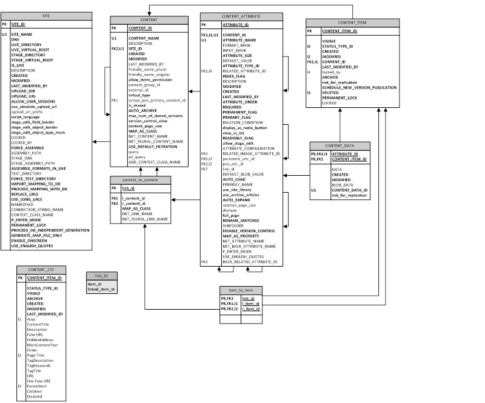

# Основные таблицы и поля

Таблицы могут быть разделены на пользовательские и системные. Системные таблицы присутствуют в системе всегда (в рамках текущей версии базы). Пользовательские отличаются от проекта к проекту, они создаются, обновляются и удаляются в результате действий пользователя. Информация о том, как должны создаваться пользовательские таблицы (метаинформация) хранится в системных таблицах. В данном разделе описаны основные системные таблицы, влияющие на создание пользовательских таблиц, а также общие поля пользовательских таблиц.

Пользовательские таблицы фактически являются "материализованными представлениями", то есть их можно использовать для быстрого чтения, но запись нужно осуществлять в системные таблицы, которые являются мастером для контентной информации (Таблица CONTENT_ITEM, Таблица CONTENT_DATA). Из этих системных таблиц информация с помощью триггеров и хранимых процедур переносится в пользовательские таблицы. Прямая запись в пользовательские таблицы запрещена, так как записанная информация будет утеряна при очередном срабатывании триггеров. Для изменения информации следует использовать один из вариантов API, описанных в [руководстве разработчика](https://storage.qp.qsupport.ru/qa_official_site/images/downloads/qp8-dev-man.pdf):

 - Метод MassUpdate класса DBConnector (раздел 5.4.1)
 - Класс ContentItem (раздел 5.4.4)
 - LINQ-to-SQL (раздел 5.5)
 - EF6 (раздел 5.6)
 - EF.Core (раздел 5.7)

_Рис. №1 Структура основных таблиц CMS QP8_

## Таблица SITE

Хранит информацию о логических сайтах, заведенных в системе. В зависимости от реализации один логический сайт может соответствовать нескольким физическим или наоборот.

| Имя поля       | Описание |
|----------------|----------|
| SITE_ID | Уникальный числовой идентификатор, генерируется автоматически |
| SITE_NAME­ | Уникальное имя сайта |
| DNS | Поле DNS (используется при формирования URL на сайт, в.т.ч. из бэкенда) |
| LIVE_DIRECTORY | Физический путь к live-папке сайта (используется только при создании сайта на шаблонах QP) |
| LIVE_VIRTUAL_ROOT | Виртуальный путь к live-папке сайта (используется при формирования URL на сайт, в.т.ч. из бэкенда) |

### STAGE_DIRECTORY

Физический путь к stage-папке сайта (используется только при создании сайта на шаблонах QP)

### STAGE_VIRTUAL_ROOT

Виртуальный путь к stage-папке сайта (используется при формирования URL на сайт, в.т.ч. из бэкенда)

### IS_LIVE

Булев признак, показывающий в каком режиме находится сайт: live или stage (влияет на сборку)

### DESCRIPTION­

Описание сайта (в бэкенде QP8)

### CREATED

Дата создания сайта. Генерируется автоматически

### MODIFIED­

Дата последнего изменения сайта. Генерируется и изменяется автоматически.

### LAST_MODIFIED_BY

ID последнего пользователя ([Таблица USERS](#таблица-users)), менявшего свойства сайта

### UPLOAD_DIR­

Физический путь к upload-папке сайта

### UPLOAD_URL­

Виртуальный путь к upload-папке сайта

### ALLOW_USER_SESSIONS

Булев признак, включающий на сайте пользовательские сессии (используется только при создании сайта на шаблонах QP)

### use_absolute_upload_url

Булев признак, позволяющий задать явно префикс URL загрузки вместо неявного использования DNS

### upload_url_prefix

Префикс URL

### script_language

Типсборки

### stage_edit_field_border

Настройки режима OnScreen в ASP. Устаревшее поле (сохранено для обратной совместимости)

### stage_edit_object_border

Настройки режима OnScreen в ASP. Устаревшее поле (сохранено для обратной совместимости)

### stage_edit_object_type_mask

Настройки режима OnScreen в ASP. Устаревшее поле (сохранено для обратной совместимости)

### LOCKED

Дата последней блокировки свойств сайта (NULL, если свойства сайта не заблокированы)

### LOCKED_BY

ID пользователя ([Таблица USERS](#таблица-users)), заблокировавшего свойства сайт (NULL, если свойства сайта не заблокированы)

### FORCE_ASSEMBLE

Булев признак, форсирующий сборку объектов вне зависимости от их даты модификации (используется только при создании сайта на шаблонах QP). После сборки параметр автоматически сбрасывается.

### ASSEMBLY_PATH

Путь к bin-папке сайта в live-режиме (используется при копировании DLL, и для генерации классов для контентов)

### STAGE_DNS

Поле DNS в stage-режиме. Если не задано, используется поле DNS.

### STAGE_ASSEMBLY_PATH

Путь к bin-папке сайта в stage-режиме(используется при копировании DLL, и для генерации классов для контентов)

### ASSEMBLE_FORMATS_IN_LIVE

Булев признак, форсирующий сборку служебных форматов (уведомления, preview) в live-режиме (используется только при создании сайта на шаблонах QP)

### TEST_DIRECTORY

Тестовая папка для сборки (используется только при создании сайта на шаблонах QP)

### FORCE_TEST_DIRECTORY

Булев признак, форсирующий сборку в тестовую папку (используется только при создании сайта на шаблонах QP)

### IMPORT_MAPPING_TO_DB

Булев признак, заставляющий выполнить импорт LINQ-имен для контентов и полей из файла маппинга, заданного вручную. После импорта параметр автоматически сбрасывается.

### PROCEED_MAPPING_WITH_DB

Булев признак, позволяющий выбрать сборку LINQ-классов по информации, заданной в базе, либо по файлу маппинга, заданного вручную.

### REPLACE_URLS

Булев параметр, установка которого заставляет выполнять прямую и обратную замену плэйсхолдеров в LINQ-классах на реальные URL, использующиеся на сайте

### USE_LONG_URLS

Булев параметр, указывающий на какие URL заменять плэйсхолдеры в LINQ-классах: на короткие или на длинные

### NAMESPACE

Пространство имен для LINQ-классов

### CONNECTION_STRING_NAME

Имя строки подключения из конфигурационного файла приложения для LINQ-классов

### CONTEXT_CLASS_NAME

Имя генерируемого контекстного класса

### P_ENTER_MODE

Выбор поведения визуального редактора при нажатии Enter (также влияет на другие сценарии). Глобальная настройка уровня сайта, которая может быть перекрыта на уровне поля. (P_ENTER_MODE)

### PERMANENT_LOCK

Булев параметр, указывающий на то, что блокировка сайта является постоянной (сохраняющейся между сессиями пользователя).

### PROCEED_DB_INDEPENDENT_GENERATION

Булев признак, указывающий создавать LINQ-классы, не привязанные К БД (при этом также создается map-файл, хранящий привязку классов к БД)

### GENERATE_MAP_FILE_ONLY

Булев признак, указывающий создавать только map-файл (хранящий привязку классов к БД)

### ENABLE_ONSCREEN

Устаревшее поле (сохранено для обратной совместимости)

### USE_ENGLISH_QUOTES

Булев признак, определяющий поведение модуля типографирования визуального редактора: использовать английские кавычки или русские. Глобальная настройка уровня сайта, которая может быть перекрыта на уровне поля. (USE_ENGLISH_QUOTES)

### EXTERNAL_URL

URL для вызова внешних уведомлений

### SEND_NOTIFICATIONS

Булев признак, указывающий посылать ли уведомления в сгенерированных LINQ-to-SQL классах

### EXTERNAL_CSS

Поле, хранящее информацию об одном или нескольких внешних CSS, подключаемых к визуальному редактору. Глобальная настройка уровня сайта, которая может быть перекрыта на уровне поля (EXTERNAL_CSS).

### ROOT_ELEMENT_CLASS

Поле, задающее класс для корневого элемента визуального редактора (полезно при использовании внешних CSS). Глобальная настройка уровня сайта, которая может быть перекрыта на уровне поля (ROOT_ELEMENT_CLASS).

### XAML_DICTIONARIES

Текстовое поле типа NTEXT, хранящее информацию о XAML-словарях, использующихся механизмом пользовательской валидации статей.

### CONTENT_FORM_SCRIPT

Хранит глобальные скрипты для форм статей (применяется для всех контентов)

### EXTERNAL_DEVELOPMENT
### DOWNLOAD_EF_SOURCE
### DISABLE_LIST_AUTO_WRAP
### REPLACE_URLS_IN_DB

## Триггеры

### ti_statuses_and_default_notif­

Выполняется после создания сайта, создает группу, статусы и шаблон уведомлений по умолчанию.

### tu_site_formats_modified

Выполняется после обновления сайта. Изменяет даты модификации страниц и форматов при изменении существенных свойств сайта, влияющих на сборку (используется только при создании сайта на шаблонах QP)

### ti_access_site

Выполняется после создания сайта. Дает максимальные права доступа на созданный сайт его автору

### tbd_delete_site

Вызывается перед удалением сайта. Выполняет его быструю (по сравнению с каскадным удалением) и корректную очистку (обрабатываются циклические ссылки).

## Таблица CONTENT

Данная таблица хранит общую информацию о контентах (пользовательских таблицах, создаваемых посредством бэкенда QP8.Framework)

### CONTENT_ID

Уникальный числовой идентификатор контента, генерируется автоматически

### CONTENT_NAME

Уникальное (в пределах сайта) имя контента

### DESCRIPTION

Описание контента (в бэкенде QP8)

### SITE_ID

ID родительского сайта ([Таблица SITE](#таблица-site))

### CREATED

Дата создания контента. Генерируется автоматически

### MODIFIED

Дата последнего изменения контента. Генерируется и изменяется автоматически.

### LAST_MODIFIED_BY

ID последнего пользователя ([Таблица USERS](#таблица-users)), менявшего свойства контента

### friendly_name_plural

Дружественное имя контента (множественное число). Не используется в QP8. Оставлено для совместимости с QP7

### friendly_name_singular

Дружественное имя контента (единственное число). Не используется в QP8. Оставлено для совместимости с QP7

### allow_items_permission

Флаг, включающий права доступа на уровне статей

### content_group_id

ID родительской группы контентов ([Таблица CONTENT_GROUP](#таблица-content_group))

### external_id

Внешний ID контента (интеграция). Не используется в QP8. Оставлено для совместимости с QP7

### virtual_type

Числовое поле, характеризующее тип виртуального контента, 0 соответствует реальному контенту

### virtual_join_primary_content_id

ID базового контента, на котором строится виртуальный контент типа JOIN.

### is_shared

Признак, указывающий на то, что контент является видимым для других сайтов в интерфейсе QP8

### AUTO_ARCHIVE

Флаг, задающий следующее поведение: при удалении статей контента вместо удаления они помещаются в архив.

### max_num_of_stored_versions

Максимальное число версий, которое хранится для каждой статьи контента. При превышении числа самая старая версия удаляется. Значение 0 соответствует тому, что версии не хранятся.

### version_control_view

Создание отдельного представления для версий статей контента. Не используется в QP8. Оставлено для совместимости с QP7.

### content_page_size

Число статей, показываемых на одной странице в табличном представлении контента

### MAP_AS_CLASS

Признак, указывающий генерировать LINQ-класс для данного контента

### NET_CONTENT_NAME

.NET-имяконтента. Используется при генерации LINQ-класса.

### NET_PLURAL_CONTENT_NAME

.NET-имя контента (множественное число). Используется при генерации LINQ-класса.

### USE_DEFAULT_FILTRATION

Признак, заставляющий генерируемый LINQ-класс использовать фильтрацию по умолчанию при чтении данных из базы.

### Query

SQL запрос, определяющий виртуальный контент типа USER QUERY. В результате генерируется представление (Пользовательские представления вида CONTENT_NNN)

### alt_query

SQL запрос, определяющий виртуальный контент типа USER QUERY для stage. В результате генерируется представление (Пользовательские представления вида CONTENT_NNN_UNITED)

### ADD_CONTEXT_CLASS_NAME

Дополнительное имя контекстного класса. Позволяет сгенерировать для небольшой группы контентов отдельный контекстный класс.

### XAML_VALIDATION

Правила пользовательской валидации статей контента, задаваемые в виде XAML. Могут ссылаться на словари (XAML_DICTIONARIES), заданные на уровне сайта

### DISABLE_XAML_VALIDATION

Флаг, позволяющий временно отключить пользовательскую валидацию для статей контента, без удаления правил

### DISABLE_CHANGING_ACTIONS

Флаг, запрещающий прямое редактирование содержимого контента через бэкенд QP8. Редактирование предполагается только через механизм JS-инетграции.

### PARENT_CONTENT_ID

ID родительского контента (используется механизмом наследования)

### USE_FOR_CONTEXT

Признак того, что контент используется для переключения контекстов (используется механизмом вариаций)

### FORM_SCRIPT

Пользовательский JS-скрипт, подгружаемый при редактировании статей

### FOR_REPLICATION

Не используется

### TRACE_IMPORT_SCRIPT

Пользовательский JS-скрипт, используемый при импорте статей

## _Триггеры_

### tbd_delete_content

Вызывается перед удалением контента. Выполняет его быструю (по сравнению с каскадным удалением) и корректную очистку (обрабатываются циклические ссылки).

### tiud_remove_empty_content_groups

Вызывается после создания, обновления, удаления контента. Удаляет пустые группы контентов ([Таблица CONTENT_GROUP](#таблица-content_group)), если они появились.

### ti_insert_modify_row

Вызывается после создания контента. Добавляет запись в таблицу CONTENT_MODIFICATION([Таблица CONTENT_MODIFICATION](#таблица-content_modification)).

### ti_access_content

Вызывается после создания контента. Создает правила доступа к контенту по умолчанию

### ti_create_fields

Вызывается после создания контента. Создает поля контента по умолчанию

### td_drop_table

Вызывается после удаления контента. Удаляет соответствующие пользовательские таблицы и представления

## Таблица CONTENT_ATTRIBUTE

Данная таблица хранит информацию о полях контентов (пользовательских таблиц, создаваемых через бэкенд QP8.Framework)

### ATTRIBUTE_ID

Уникальный числовой идентификатор поля, генерируется автоматически

### CONTENT_ID

Идентификатор родительского контента. [Таблица CONTENT](#Таблица-CONTENT)

### ATTRIBUTE_NAME

Уникальное имя поля (в пределах контента). Именно это имя становится названием столбца пользовательской таблицы ([Пользовательские таблицы вида CONTENT_NNN](#пользовательские-таблицы-вида-content_nnn)).

### FORMAT_MASK

В настоящее время не используется. Оставлено для обратной совместимости с QP7.

### INPUT_MASK

Маска ввода для поля типа Строка. Задается в виде регулярного выражения.

### ATTRIBUTE_SIZE

В данном поле хранятся разные значения для разных типов полей, например, для поля типа Строка хранится длина этой строки

### DEFAULT_VALUE

Значение по умолчанию, для не-BLOB-полей (все кроме Визуальный редактор, Текстовое окно). Для связи типа M2M здесь хранится link_id, а само значение по умолчанию хранится в отдельной таблице (Таблица FIELD_ARTICLE_BIND).

### ATTRIBUTE_TYPE_ID

ID типа поля ([Таблица ATTRIBUTE_TYPE](#таблица-attribute_type))

### RELATED_ATTRIBUTE_ID

ID отображаемого поля для полей типа связь O2M (также косвенным образом указывает на связанный контент)

### INDEX_FLAG

Признак, указывающий на то, что на поле создается индекс

### DESCRIPTION

Описание поля (в бэкенде QP)

### MODIFIED

Дата последнего изменения поля. Генерируется и изменяется автоматически.

### CREATED

Дата создания поля. Генерируется автоматически

### LAST_MODIFIED_BY

ID последнего пользователя ([Таблица USERS](#таблица-users)), менявшего свойства контента

### ATTRIBUTE_ORDER

Числовое значение, определяющее порядок полей в контенте (может не совпадать с физическим порядком полей в пользовательской таблице)

### REQUIRED

Признак, указывающий на обязательность поля.

### PERMANENT_FLAG

Не используется в QP8. Оставлено для совместимости с QP7

### PRIMARY_FLAG

Не используется в QP8. Оставлено для совместимости с QP7

### RELATION_CONDITION

Строка (используется в предложении WHERESQL-запроса), определяющая условие на связь (O2M или M2M)

### display_as_radio_button

Не используется в QP8. Оставлено для совместимости с QP7

### view_in_list

Признак, указывающий на то, что поле является отображаемым в табличном представлении контента

### READONLY_FLAG

Признак, указывающий на то, что поле недоступно для редактирования через бэкенд

### allow_stage_edit

Не используется в QP8. Оставлено для совместимости с QP7

### ATTRIBUTE_CONFIGURATION

Не используется в QP8. Оставлено для совместимости с QP7

### RELATED_IMAGE_ATTRIBUTE_ID

ID базового поля изображения ([Таблица CONTENT_ATTRIBUTE](#таблица-content_attribute)) для поля типа Динамическое изображение.

### persistent_attr_id

ID поля в базовом контенте ([Таблица CONTENT_ATTRIBUTE](#таблица-content_attribute)), на котором построен виртуальное поле в JOIN-контенте

### join_attr_id

ID поля в текущем виртуальном JOIN-контенте ([Таблица CONTENT_ATTRIBUTE](#таблица-content_attribute)), которое является ближайшим связующим (ближайшим, необходимым для включении в иерархию).

### link_id

ID связи между контентами ([Таблица CONTENT_TO_CONTENT](#таблица)), для поля типа связь M2M. Наличие не-NULL значения в данном поле определяет тип связи (если ATTRIBUTE_TYPE_ID = 11) Если данное поле не NULL, то связь M2M, если NULL, то O2M.

### DEFAULT_BLOB_VALUE

Значение по умолчанию для BLOB-полей (Визуальный редактор, Текстовое окно)

### AUTO_LOAD

В QP7 используется как признак автозагрузки полей Визуальный редактор и Связь. В QP8 не используется. Оставлено для совместимости с QP7

### FRIENDLY_NAME

Дружественное имя поля. Используется для отображения в бэкенде.

### use_site_library

Признак для полей типа Файл и Изображение, указывающий использовать для хранения файлов библиотеку сайта вместо библиотеки контента

### use_archive_articles

В QP7 управляет включением архивных статей в список отображаемых. Не используется в QP8. Оставлено для совместимости с QP7

### AUTO_EXPAND

Управляет автоматическим развертыванием поля Визуальный редактор при загрузке формы статьи.

### relation_page_size

Не используется в QP8. Оставлено для совместимости с QP7

### Doctype

Строка, описывающая допустимый Doctype для визуального редактора.

### full_page

Признак, разрешающий помещение в визуальный редактор целого документа, включающего теги html

### RENAME_MATCHED

Признак, говорящий о том, что загружаемые в это поле файлы с одинаковыми именами должны переименовываться. В случае, если флаг сброшен, пользователю приходит запрос на перезапись файла.

### SUBFOLDER

Для поля типа Файл или Изображение задает подпапку для загрузки файлов. Папка задается относительно текущей библиотеки сайта или контента (что определяется полем use_site_library)

### DISABLE_VERSION_CONTROL

Возможность отключение хранения версий для поля типа Файл или Изображение.

### MAP_AS_PROPERTY

Признак, указывающий генерировать LINQ-свойство для данного поля

### NET_ATTRIBUTE _NAME

.NET-имя поля. Используется при генерации LINQ-свойства.

### NET_BACK_ATTRIBUTE _NAME

.NET-имя обратного поля. Используется для поля типа Связь O2M, в том случае, если для него не задано обратное M2O-поле.

### P_ENTER_MODE

Выбор поведения визуального редактора при нажатии Enter (также влияет на другие сценарии). Локальная настройка уровня поля, которая может перекрывать глобальную настройку уровня сайта (P_ENTER_MODE).

### USE_ENGLISH_QUOTES

Булев признак, определяющий поведение модуля типографирования визуального редактора: использовать английские кавычки или русские. Локальная настройка уровня поля, которая может перекрывать глобальную настройку уровня сайта (USE_ENGLISH_QUOTES).

### BACK_RELATED_ATTRIBUTE_ID

ID базовогополятипаСвязь O2M ([Таблица CONTENT_ATTRIBUTE](#таблица-content_attribute)). Задается для поля типа Cвязь M2O.

### IS_LONG

Признак, указывающий на то, что числовое поле нужно генерировать в LINQ-классе как Int64 (в противном случае генерируется Int32)

### EXTERNAL_CSS

Поле, хранящее информацию об одном или нескольких внешних CSS, подключаемых к визуальному редактору. Локальная настройка уровня поля, которая может перекрывать глобальную настройку уровня сайта (EXTERNAL_CSS).

### ROOT_ELEMENT_CLASS

Поле, задающее класс для корневого элемента визуального редактора (полезно при использовании внешних CSS). Локальная настройка уровня поля, которая может перекрывать глобальную настройку уровня сайта (ROOT_ELEMENT_CLASS).

### USE_FOR_TREE

Признак, который задается у поля типа связь O2M, ссылающегося на тот же самый контент и говорящий о том, что поле нужно использовать для построения дерева.

### AUTO_CHECK_CHILDREN

Признак, который задается у поля типа связь O2M, ссылающегося на тот же самый контент и говорящий о том, что при выделении родительского элемента в дереве нужно автоматически выделять дочерние элементы.

### AGGREGATED

Признак, указывающий на то, что данное поле типа Связь реализует отношение агрегации.

### CLASSIFIER_ATTRIBUTE_ID

ID поляклассификатора ([Таблица CONTENT_ATTRIBUTE](#таблица-content_attribute)). Задается для агрегированных связей.

### IS_CLASSIFIER

Признак того, что числовое поле реализует тип Классификатор

### CHANGEABLE

Признак того, что значение поля типа Классификатор можно менять для существующих статей

### USE_RELATION_SECURITY

Признак того, что по данной связи вычисляются права доступа на текущий контент (поддерживаются связи O2M и M2M)

### COPY_PERMISSIONS_TO_CHILDREN

Признак, который задается у поля типа связь O2M, ссылающегося на тот же самый контент и говорящий о том, что при добавления нового элемента в иерархию, нужно скопировать права доступа у родительского элемента.

### ENUM_VALUES

Поле с внутренней структурой, хранящее определение Строкового перечисления.

### SHOW_AS_RADIO_BUTTON

Настройка поля Связь, определяющая его показ как список радиокнопок вместо выпадающего списка

### USE_FOR_DEFAULT_FILTRATION

Признак, указывающий на то, что поле связь используется для механизма фильтрации по умолчанию

### TREE_ORDER_FIELD

ID поля ([Таблица CONTENT_ATTRIBUTE](#таблица-content_attribute)), которое используется для сортировке в поле связи

### PARENT_ATTRIBUTE_ID

ID родительского поля ([Таблица CONTENT_ATTRIBUTE](#таблица-content_attribute)), которое используется для реализации механизма наследования

### HIDE

Признак указывающий на то, что унаследованное поле не должно отображаться

### OVERRIDE

Признак указывающий на то, что унаследованное поле перекрывает родительское (не является его точной копией)

### USE_FOR_CONTEXT

Признак того, что поле типа связь ссылается на контент, используемый для переключения контекстов (механизм вариаций)

### USE_FOR_VARIATIONS

Признак того, что поле типа связь задает на базовую статью для вариаций

### ORDER_BY_TITLE

Признак того, что сортировка по умолчанию для поля типа Связь должна выполняться по заголовку, а не по ID

### FIELD_TITLE_COUNT

Количество полей, которые должны объединяться в заголовке при выводе списка для поля типа Связь

### INCLUDE_RELATIONS_IN_TITLE

Флаг, указывающий учитывать ли поля связей при формировании заголовка

### USE_IN_CHILD_CONTENT_FILTER

Флаг, указывающий что пользователь может использовать данное поле при фильтрации дочернего контента

### OPTIMIZE_FOR_HIERARCHY

Флаг для связей M2M на иерархический контент, при установке которого выполняется оптимизация при сохранении в БД:
 - Если установлены все дочерние элементы, то устанавливается родительский элемент, а дочерние сбрасываются
 - Процесс при необходимости повторяется для более высоких уровней

### IS_LOCALIZATION

Является ли полем локализации

### USE_SEPARATE_REVERSE_VIEWS

В настоящее время не используется
### DISABLE_LIST_AUTO_WRAP

Настройка визуального редактора, отключающая автооборачивание элементов списка

### TA_HIGHLIGHT_TYPE

Тип подсветки для поля TextBox: XML, JSON или HTML
### MAX_DATA_LIST_ITEM_COUNT

### TRACE_IMPORT

При установке поле трассируется при импорте и результат потом может быть использован в скрипте

### DENY_PAST_DATES

При установке не разрешает ввод дат в прошлом.

## Триггеры

### ti_insert_field

Выполняется после создания поля. Добавляет соответствующее поле в контентные таблицы ([Пользовательские таблицы вида CONTENT_NNN](#пользовательские-таблицы-вида-content_nnn), [Пользовательские таблицы вида CONTENT_NNN_ASYNC](#пользовательские-таблицы-вида-content_nnn_async), а также перестраивает представления (Пользовательские представления вида CONTENT_NNN_UNITED, Пользовательские представления вида CONTENT_NNN_LIVE, Пользовательские представления вида CONTENT_NNN_STAGE)

### tu_update_field

Выполняется после обновления поля. Обновляет соответствующее поле в контентной таблице ([Пользовательские таблицы вида CONTENT_NNN](#пользовательские-таблицы-вида-content_nnn), [Пользовательские таблицы вида CONTENT_NNN_ASYNC](#пользовательские-таблицы-вида-content_nnn_async), а также перестраивает представления (Пользовательские представления вида CONTENT_NNN_UNITED, Пользовательские представления вида CONTENT_NNN_LIVE, Пользовательские представления вида CONTENT_NNN_STAGE)

### td_remove_field

Выполняется после удаления поля. Удаляет соответствующее поле из контентной таблицы ([Пользовательские таблицы вида CONTENT_NNN](#пользовательские-таблицы-вида-content_nnn), [Пользовательские таблицы вида CONTENT_NNN_ASYNC](#пользовательские-таблицы-вида-content_nnn_async), а также перестраивает представления (Пользовательские представления вида CONTENT_NNN_UNITED, Пользовательские представления вида CONTENT_NNN_LIVE, Пользовательские представления вида CONTENT_NNN_STAGE)

### ti_set_max_order

Выполняется после создания поля. Устанавливает ATTRIBUTE_ORDER в значение большее, чем остальные поля контента

### td_reorder_fields

Выполняется после удаления поля. Пересчитывает значения ATTRIBUTE_ORDER для остальных полей

### tu_content_attribute_clean_empty_links

Выполняется после обновления поля. Удаляет ссылки между контентами ([Таблица CONTENT_TO_CONTENT](#таблица-content_to_content)), которые перестали использоваться (link_id)

### td_content_attribute_clean_empty_links

Выполняется после удаления поля. Удаляет ссылки между контентами ([Таблица CONTENT_TO_CONTENT](#таблица-content_to_content)), которые перестали использоваться (link_id)

## Таблица CONTENT_ITEM

Данная таблица хранит служебную информацию о статьях контентов (записях в пользовательских таблицах, создаваемых через бэкенд QP8.Framework)

### CONTENT_ITEM_ID

Уникальный числовой идентификатор, генерируется автоматически

### VISIBLE

Флаг, позволяющий при его сбросе скрыть статью. Используется расписанием показа.

### STATUS_TYPE_ID

ID статуса статьи по Workflow ([Таблица STATUS_TYPE](#таблица-status_type)). Если на статью не назначено Workflow, то значением будет Published для текущего сайта.

### CREATED

Дата создания статьи. Генерируется автоматически

### MODIFIED

Дата последнего изменения статьи. Генерируется и изменяется автоматически.

### LAST_MODIFIED_BY

ID последнего пользователя ([Таблица USERS](#таблица-users)), менявшего свойства статьи

### CONTENT_ID

ID родительского контента ([Таблица CONTENT](#таблица-content))

### LOCKED

Дата последней блокировки статьи (NULL, если статья не заблокирована)

### LOCKED_BY

ID пользователя ([Таблица USERS](#таблица-users)), заблокировавшего статью (NULL, если статья не заблокирована)

### ARCHIVE

Флаг, который указывает на то, что статья является архивной.

### not_for_replication

Флаг, который указывает на то, что при изменении данных статьи в таблице CONTENT_DATA ([Таблица CONTENT_DATA](#таблица-content_data)) информация не будет сразу перенесена в контентные таблицы ([Пользовательские таблицы вида CONTENT_NNN](#пользовательские-таблицы-вида-content_nnn), [Пользовательские таблицы вида CONTENT_NNN_ASYNC](#пользовательские-таблицы-вида-content_nnn_async), это должно произойти потом при вызове одной их хранимых процедур массового обновления

### SCHEDULE_NEW_VERSION_PUBLICATION

Флаг, который говорит о том, что для статьи установлена отложенная публикация

### SPLITTED

Вспомогательный флаг (устанавливается триггером), который говорит о том, что статья расщеплена.

### PERMANENT_LOCK

Булев параметр, указывающий на то, что блокировка статьи является постоянной (сохраняющейся между сессиями пользователя).

### CANCEL_SPLIT

Флаг, позволяющий отменить расщепление статьи

### UNIQUE_ID

## Триггеры

### ti_insert_item

Выполняется после создания статьи. Добавляет строку, соответствующую добавленной статье в контентную таблицу ([Пользовательские таблицы вида CONTENT_NNN](#пользовательские-таблицы-вида-content_nnn))

### tu_update_item

Выполняется после обновления статьи. Обновляет строку, соответствующую обновленной статье в контентной таблице ([Пользовательские таблицы вида CONTENT_NNN](#пользовательские-таблицы-вида-content_nnn)). Кроме того, может создаваться, обновлятся и удаляться строка в асинхронной контентной таблице (Пользовательские таблицы вида CONTENT_NNN_ASYNC), реализуя расщепление и слияние статьи.

### tiu_populate_content_data

Выполняется после создания или обновления статьи. Добавляет недостающие пустые записи в таблице CONTENT_DATA.

### ti_save_content_item_history

Выполняется после создания статьи. Добавляет исторические записи в лог-таблицу ([Таблица CONTENT_ITEM_STATUS_HISTORY](#таблица-content_item_status_history))

### tu_save_content_item_history

Выполняется после обновления статьи. Добавляет исторические записи в лог-таблицу ([Таблица CONTENT_ITEM_STATUS_HISTORY](#таблица-content_item_status_history))

### tu_not_for_replication

Выполняется после обновления статьи. Cинхронизирует значения поля not_for_replication таблицы CONTENT_DATA с одноименным полем текущей таблицы

### ti_access_content_item

Выполняется после создания статьи. Добавляет права доступа по умолчанию для статьи, если для контента включен режим прав доступа на статьи (Поле allow_items_permission)

### tbd_delete_content_item

Выполняется перед удалением статьи. Удаляет все дочерние данные статьи для которых нет каскадного удаления.

## Таблица CONTENT_DATA

Хранит содержимое всех пользовательских таблиц ([Пользовательские таблицы вида CONTENT_NNN](#пользовательские-таблицы-вида-content_nnn)). Каждая строка в данной таблице соответствует ячейке в пользовательской таблице и копируется туда триггером или одной из хранимых процедур массового копирования.

На полях DATA и BLOB_DATA построен полнотекстовый индекс

### ATTRIBUTE_ID

Идентификатор поля – столбца пользовательской таблицы ([Таблица CONTENT_ATTRIBUTE](#таблица-content_attribute)).

### CONTENT_ITEM_ID

Идентификатор статьи – строки пользовательской таблицы ([Таблица CONTENT_ITEM](#таблица-content_item))

### DATA

Текстовое поле для хранения относительно небольших значений (соответствует всем типам полей, кроме Визуального Редактора и Текстового окна).

### CREATED

Дата создания записи. Генерируется автоматически

### MODIFIED

Дата последнего изменения записи. Генерируется и изменяется автоматически.

### BLOB_DATA

Текстовое поле для хранения больших значений (соответствует типам полей Визуальный Редактор и Текстовое окно).

### CONTENT_DATA_ID

Уникальный идентификатор записи (используется для полнотекстового индекса)

### not_for_replication

Флаг, который будучи установленнным отключает копирование информации из данной строки в ячейку пользовательской таблицы.

### SPLITTED
### O2M_DATA

## Триггеры
### tiu_content_fill
## Пользовательские таблицы вида CONTENT_NNN

Пользовательские таблицы. Их структура определяется в бэкенде QP8.Framework. Каждой таблице соответствует одна строка в таблице CONTENT ([Таблица CONTENT](#таблица-content)). NNN в названии таблицы – ID записи в этой таблице. Таблица содержит фиксированное количество системных полей, описанных ниже и произвольное количество пользовательских полей. Каждому пользовательскому полю соответствует строка в таблице CONTENT_ATTRIBUTE ([Таблица CONTENT_ATTRIBUTE](#таблица-content_attribute)). Каждой строке рассматриваемой таблицы соответствует строка в таблице CONTENT_ITEM ([Таблица CONTENT_ITEM](#таблица-content_item)). Каждой ячейке в рассматриваемой таблице соответствует строка в таблице CONTENT_DATA ([Таблица CONTENT_DATA](#таблица-content_data)).

Эти таблицы нельзя редактировать напрямую, вся информация в них заносится триггерами, либо хранимыми процедурами массового копирования.

## Системные поля

### CONTENT_ITEM_ID

Уникальный числовой идентификатор. Копируется триггером из поля CONTENT_ITEM_ID таблицы CONTENT_ITEM

### VISIBLE

Флаг, управляющий показом/скрытием статьи. Копируется триггером из поля VISIBLE таблицы CONTENT_ITEM.

### STATUS_TYPE_ID

ID статуса статьи по Workflow ([Таблица STATUS_TYPE](#таблица-status_type)). Копируется триггером из поля STATUS_TYPE_ID таблицы CONTENT_ITEM.

### CREATED

Дата создания статьи. Копируется триггером из поля CREATED таблицы CONTENT_ITEM.

### MODIFIED

Дата последнего изменения статьи. Копируется триггером из поля MODIFIED таблицы CONTENT_ITEM.

### LAST_MODIFIED_BY

ID последнего пользователя ([Таблица USERS](#таблица-users)), менявшего свойства статьи. Копируется триггером из поля LAST_MODIFIED_BY таблицы CONTENT_ITEM.

### ARCHIVE

Флаг, который указывает на то, что статья является архивной. Копируется триггером из поля ARCHIVE таблицы CONTENT_ITEM.

## Пользовательские поля

Каждому пользовательскому полю (колонке пользовательской таблицы) соответствует запись в таблице CONTENT_ATTRIBUTE ([Таблица CONTENT_ATTRIBUTE](#таблица-content_attribute)) для текущего контента. Название колонки берется из поля ATTRIBUTE_NAME. Тип данных определяется в соответствии со значением ATTRIBUTE_TYPE_ID колонкой DATABASE_TYPE в таблице ATTRIBUTE_TYPE. Размер данных берется из поля ATTRIBUTE_SIZE. Для NVARCHAR – это максимальная длина строки (по умолчанию – 255). Для NUMERIC – число знаков после запятой (по умолчанию – 0).

Поля типа файл или изображение хранят только название файла, сам файл хранится в файловой системе. Также в некоторых случаях поля типа файл и изображение и во всех случаях поле Динамическое изображения хранят относительный путь к файлу (от корня библиотеки или корневой подпапки (SUBFOLDER), если она задана).

Все типы полей, связанные с датами: Дата, Время, Дата & Время хранятся как DATETIME (совместимость со старыми версиями SQLServer)

Типы полей Визуальный редактор и Текстовое окно хранятся как NTEXT.

Поля M2O и М2М не хранят свои данные непосредственно в контентной таблице. Им соответствует тип данных NUMERIC. В контентой таблице они хранят вспомогательные данные. M2M – LINK_ID. M2O – BACK_RELATED_ATTRIBUTE_ID. Это позволяет на основании строки контентной таблицы сразу считывать связанные данные, не прибегая к дополнительным подзапросам.

Данные M2M хранятся в таблице ITEM_TO_ITEM (альтернативный способ доступа – представление ITEM_LINK)

Тип данных классификатор построен на числовом типе данных (ATTRIBUTE_TYPE_ID = 2). Он отличается установленным флагом IS_CLASSIFIER = 1. В таком поле хранится ID контента-расширения (CONTENT_ID), который используется в данной статье.

## Пользовательские таблицы вида CONTENT_NNN_ASYNC

Каждой таблице CONTENT_NNN ([Пользовательские таблицы вида CONTENT_NNN](#пользовательские-таблицы-вида-content_nnn)) соответствует таблица CONTENT_NNN_ASYNC. Структура обеих таблиц совпадает. В последней хранятся текущие версии расщепленных статей (таких записей в таблице CONTENT_ITEM ([Таблица CONTENT_ITEM](#таблица-content_item)), для которых установлено SPLITTED= 1)

## Таблица CONTENT_TO_CONTENT

Хранит информацию о связях между пользовательскими таблицами (контентами), которые не принадлежат ни одному из контентов. В контентах эти связи представлены как поля M2M. Одной связи может соответстовать 1 или 2 поля M2M в реальных контентах и произвольное количество полей в виртуальных контентах. Как только на данную связь больше не ссылается ни одно поле, она автоматически удаляется.

### link_id

Уникальный идентификатор связи. Именно на него ссылается поле link_id в таблице CONTENT_ATTRIBUTE.

### l_content_id

Идентификатор первого контента, участвующего в связи ([Таблица CONTENT](#таблица-content))

### r_content_id

Идентификатор второго контента, участвующего в связи ([Таблица CONTENT](#таблица-content))

### MAP_AS_CLASS

Признак, указывающий генерировать LINQ-класс для узлового представления (Пользовательские представления вида LINK_NN), относящегося к данной связи.

### NET_LINK_NAME

.NET-имясвязи. Используется при генерации LINQ-класса.

### NET_PLURAL_LINK _NAME

.NET-имя связи (множественное число). Используется при генерации LINQ-класса.

### SYMMETRIC

Признак того, что связь является симметричной. Влияет на поведение триггера на таблице ITEM_TO_ITEM ([Таблица ITEM_TO_ITEM](#таблица-item_to_item))

## Триггеры

### ti_content_to_content

Выполняется после создания связи. Создает представления, относящиеся к связи (Пользовательские представления вида LINK_NN, Пользовательские представления вида LINK_NN_UNITED)

### td_content_to_content

Выполняется после удаления связи. Удаляет представления, относящиеся к связи (Пользовательские представления вида LINK_NN, Пользовательские представления вида LINK_NN_UNITED)

### tbd_delete_content_to_content

Вызывается перед удалением связи. Выполняет каскадное удаление данных M2M-полей, относящихся к удаляемой связи из таблиц ITEM_TO_ITEM и ITEM_LINK_ASYNC.

## Таблица ITEM_TO_ITEM

Хранит все данные полей M2M для статей, кроме текущих данных расщепленных статей, которые хранятся в таблице ITEM_LINK_ASYNC)

### link_id

Идентификатор связи между контентами ([Таблица CONTENT_TO_CONTENT](#таблица-content_to_content)).

### l_item_id

Идентификатор первой статьи в данных M2M ([Таблица CONTENT_ITEM](#таблица-content_item)).

### r_item_id

Идентификатор второй статьи в данных M2M ([Таблица CONTENT_ITEM](#таблица-content_item)).

### IS_REV
### IS_SELF

## Триггеры

### td_item_to_item

Выполняется после удаления записи из таблицы. Удаляет симметричную запись, если это требуется (SYMMETRIC = 1)

### ti_item_to_item

Выполняется после вставки записи в таблицу. Вставляет симметричную запись, если это требуется (SYMMETRIC = 1)

### tu_item_to_item

## Таблица ITEM_LINK_ASYNC

Хранит текущие данные полей M2M для расщепленных статей. Основные данные хранятся в таблице ITEM_TO_ITEM.

### link_id

Идентификатор связи между контентами ([Таблица CONTENT_TO_CONTENT](#таблица-content_to_content)).

### item_id

Идентификатор первой статьи в данных M2M ([Таблица CONTENT_ITEM](#таблица-content_item)).

### linked_item_id

Идентификатор второй статьи в данных M2M ([Таблица CONTENT_ITEM](#таблица-content_item)).

### IS_REV
### IS_SELF

## Триггеры

### td_item_link_async

Выполняется после удаления записи из таблицы. Удаляет запись из связующей таблицы.

### ti_item_link_async

Выполняется после вставки записи в таблицу. Вставляет запись в связующую таблицу.
